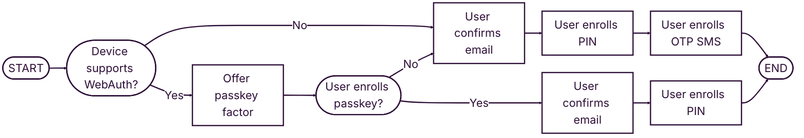
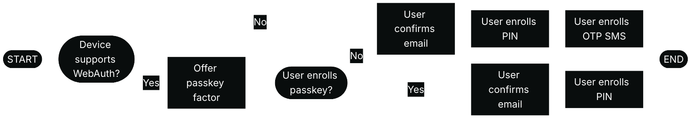
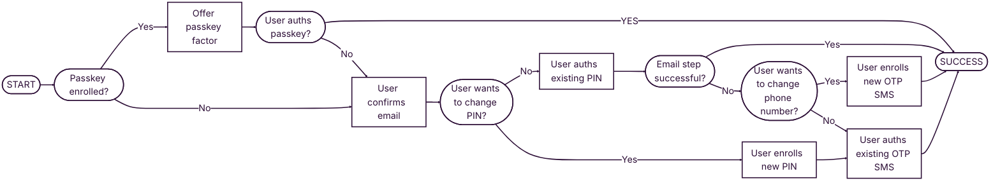
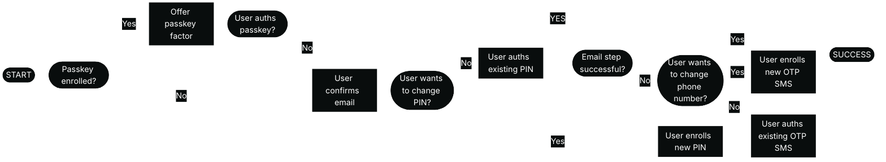
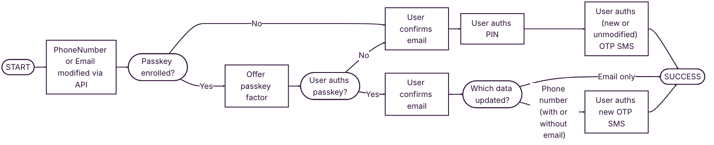
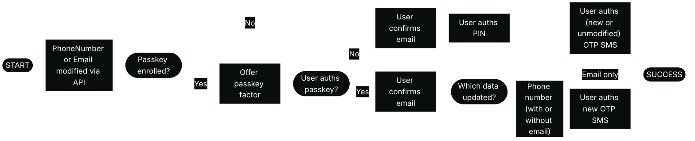

Mangopay is delivering SCA via a unique session on a hosted webpage. The URL for the session is returned on relevant API calls, and your platform needs to redirect the user to complete the session – see [SCA session](/guides/sca/session) for details on how to do this.

For the user, Mangopay's SCA session provides a user-friendly experience that guides them efficiently through all the necessary steps relating to all required factors.

Mangopay's hosted SCA session handles both enrollment and authentication.

<Note>
**Note – Session lifetime 10 minutes**

The unique SCA session is valid for 10 minutes once the `PendingUserAction.RedirectUrl` is returned by the API. 

During this time, the individual must complete all necessary steps for all factors for the session to be considered successful.

The session is identified by the unique token in the `RedirectUrl`. So if the user refreshes the screen, or closes and re-opens the same link, then they can continue using the same session within 10 minutes.
</Note>

## Localization 

The hosted SCA page is automatically set to the language of the user's browser if it is one of the following supported languages: Dutch, English, French, German, Greek, Italian, Polish, Portuguese, Spanish.

Regional variants for the same language resolve to the single translation supported by Mangopay: e.g. `es-419` (Latin American Spanish) resolves to `es`, `en-US` (American English) resolves to `en`.

If the browser is in a language not listed above, the session is in English by default.

You can override this and manually set the language for the session before you redirect the user – [read more](/guides/sca/session#4-set-the-session-language-optional).

## Welcome screen 

On the `RedirectUrl`, the user first sees a Mangopay-branded welcome screen explaining the steps that are required from them.

#### Welcome screen on enrollment

Below is an example of the SCA welcome screen for an Owner user enrolling at user creation:

#### Welcome screen on authentication

Below is an example of the SCA welcome screen for a on Owner authenticating a transfer request above 30 EUR: 

The wording is adapted for both enrollment and authentication depending on the scenario. The platform trading name is always shown, along with: 
- For a [transfer](/guides/sca/transfers) request, the transfer currency and amount
- For [recipient](/guides/sca/recipients) bank account registration, the IBAN or local account number 
- For [wallet](/guides/sca/wallets) access, a mention of access to personal account information

See what conditions trigger SCA in Sandbox for more support with testing each scenario: [users](/guides/sca/users#sca-triggers-in-sandbox), [recipients](/guides/sca/recipients#sca-triggers-in-sandbox), [transfers](/guides/sca/transfers#sca-triggers-in-sandbox), and [wallet access](/guides/sca/wallets#sca-triggers-in-sandbox).

## Email confirmation behavioral biometrics

Thanks to its expertise in AI-powered fraud prevention, Mangopay is developing a model to use behavioral biometrics to analyze the way the user types their email address.

In it's current form, the step is not a factor. Rather, it allows Mangopay to collect anonymized behavioral data on the user's keyboard or touchscreen movements. This is made possible thanks to Mangopay's fraud prevention profiler integrated in the hosted SCA session.

In the coming months, Mangopay plans to validate the email confirmation step as an SCA inherence factor. Once validated, if the user skips the passkey factor, this will enable them to authenticate using only email confirmation and PIN (and not OTP SMS). The OTP SMS factor would be used in case the model returns an uncertain or failed assessment.

<Note>
**Note – Email address requested to build behavioral profile**

Mangopay's hosted SCA session asks the user to enter their email address during both enrollment and authentication.

This enables Mangopay's profiler to build a behavioral biometrics model that in future will make it possible to use the email entry as a valid SCA factor.

For Legal Soletrader users, the address used is the `LegalRepresentative.Email` (and not the `Email`). For Natural users, the address used is the `Email`.
</Note>

Mangopay processes behavioral biometric data captured during SCA sessions solely to fulfill its authentication obligations as a regulated financial institution.

## Factors

Mangopay provides the following authentication factors.

<table>
<thead>
<tr>
  <th class="header">Factor</th>
  <th class="header">Required</th>
  <th class="header">Type</th>
  <th class="header">Description</th>
</tr>
</thead>
<tbody>
<tr>
  <td class="table-content">
  Trusted device using WebAuthn [passkey](#passkey)
  </td>
  <td class="table-content">
  No
  </td>
  <td class="table-content">
  Possession (of device) and inherence (if biometrics) or knowledge (if password or passcode)
  </td>
  <td class="table-content">
  The individual uses the native authentication features (biometrics, password, passcode) of their device that they set up during enrollment.
  </td>
</tr>
<tr>
  <td class="table-content">
  [Personal identification number (PIN)](#pin)
  </td>
  <td class="table-content">
  Yes
  </td>
  <td class="table-content">
  Knowledge
  </td>
  <td class="table-content">
  The individual enters a 6-digit code they defined during enrollment.
  </td>
</tr>
<tr>
  <td class="table-content">
  Phone-based [one-time passcode (OTP)](#otp)
  </td>
  <td class="table-content">
  If passkey not used
  </td>
  <td class="table-content">
  Possession
  </td>
  <td class="table-content">
  The individual receives a 6-digit OTP via SMS to the phone number provided during enrollment.
  </td>
</tr>
</tbody>
</table>

#### Logic governing optional trusted devices

Defining a trusted device using a WebAuthn passkey is optional. 

If the user chooses to enroll a trusted device, then only the PIN is enrolled as the second factor.

If the user chooses to authenticate using a trusted device, then the passkey alone satisfies SCA because it is a combination of two factors.

If at either point the uses skips the use of a trusted device, then the PIN and OTP are both used. Skipping the passkey is possible during authentication even if a device is already enrolled because the user may not be using their trusted device.

### Passkey 

The passkey factor relies on the Web Authentication, or WebAuthn, standard to create a set of two passkeys (or credentials): 
- A public key that is not secret and is stored on the Mangopay server
- A private key that is secret and is stored on the user's device

The private key is accessed using the device's authentication features: for example, a password or fingerprint on a laptop; or a passcode, fingerprint, or face on a smartphone.

Because WebAuthn doesn't rely on a new password, it is more resistant to phishing and data breaches. It has wide adoption on web browsers and mobile devices.

For mobile app integrations, passkeys are not supported if the `RedirectUrl` is opened in a webview. The factor must be integrated natively. See the dedicated guides for details on how to do this: 
<CardGroup cols={2}>
<Card title="iOS" href="/guides/sca/factors/passkey-ios">
Integrate the passkey factor in iOS apps
</Card>
<Card title="Android" href="/guides/sca/factors/passkey-android">
Integrate the passkey factor in Android apps
</Card>
</CardGroup>

#### Passkey device enrollment

To enroll, the user: 
1. Chooses to enroll their device as a trusted device
2. Selects where to store the passkey from the options proposed by their device
3. Authenticates using their device authentication feature (biometrics, password, passcode)

Below is an example of the enrollment process using Chrome on MacOS, a passkey stored in a Google Chrome profile, and the laptop password.

#### Passkey device authentication

During authentication:
1. Indicates that they are using their trusted device
2. Selects the passkey to use
3. Authenticates using their device authentication feature (biometrics, password, passcode)

Below is an example of the authentication process using Chrome on MacOS, a passkey stored in a Google Chrome profile, and the laptop password.

### PIN

The PIN factor relies on a 6-digit code defined and memorized by the individual, which they enter during the session.

#### PIN enrollment

To enroll, the individual: 

1. Defines and confirms a 6-digit PIN
2. Enters their PIN defined previously

#### PIN authentication

To authenticate, the individual: 

1. Enters their PIN defined previously

### OTP

The OTP factor relies on a temporary 6-digit code sent to the individual's phone, which they can enter during the session. 

<Note>
**Note – OTP lifetime 5 minutes**

While the SCA session is valid for 10 minutes, once the user clicks the button to send the SMS, the code is valid for 5 minutes.

The user can request a new code after 30 seconds, even if the first one hasn't expired.
</Note>

#### OTP enrollment

To enroll, the individual: 

1. Enters their mobile phone number (or confirms the pre-populated number, if `PhoneNumber` was present in the API call to create or update the user)
2. Enters the 6-digit code received by SMS

#### OTP authentication

To authenticate, the individual:

1. Enters the 6-digit code received by SMS

#### Test data

In Sandbox, you can use the phone number `0611111111` and `FR` (`+33611111111`) with the passcode **702100** to simulate a successful flow. You can also send this data in the `PhoneNumber` (or `LegalRepresentative.PhoneNumber`) to pre-populate the field.

You can also test by using a real phone number to receive the SMS OTP.

#### Handling phone number data

Mangopay's SCA session allows the individual to provide their phone number directly to Mangopay. This data is not shared with your platform for privacy reasons. The same phone number can be used with more than one user account.

Your platform can send the user's phone number to Mangopay via the API – in the `PhoneNumber` parameter of the Natural User or the `LegalRepresentative.PhoneNumber` of the Legal User.

If the phone number data is present in the user object, then the field is pre-populated for the user to confirm or modify.

<Note>
**Note – SCA session phone number doesn't update API**

The phone number provided or confirmed by the user during the SCA session is not subsequently updated in the User API object.

Changing the `PhoneNumber` or `LegalRepresentative.PhoneNumber` data in the API object triggers SCA re-enrollment ([read more](/guides/sca/users#re-enroll-an-enrolled-owner)).
</Note>

## Factor orchestration

The SCA session is orchestrated to optimize the enrollment and authentication experience for users. 

Mangopay aims to encourage users to choose more secure factors, such as the WebAuthn passkey, but reverts to other factors if the user skips this option. In all cases, the session meets SCA requirements and is highly secure, including if the user chooses to re-enroll a factor during the session.

The diagrams below describe the different possible flows and all options available to the user to skip or re-enroll factors.

<Note>
**Note – Email confirmation** 

Email confirmation is required in all flows, with the exception of authentication via passkey (email is still required during passkey enrollment).

Once the email confirmation is validated as a factor, the enrollment and authentication flows will modify to adopt it. 

The email address used is the `Email` for Natural users and the `LegalRepresentative.Email` for legal users. The address cannot be changed by the user during the session; it can only be changed via API, which triggers the re-enrollment flow below.
</Note>

### Initial enrollment

When the user is redirect to a Mangopay SCA session for the first time: 

- Mangopay analyzes their device to see if it supports WebAuthn passkey.
- Even if the device is compatible, the passkey can be skipped and is the only factor that can be.
- If passkey enrolled (not skipped), then the PIN and email are used as a backup.

<Check>
**Best practice – Encourage users to enroll and use passkey**

Mangopay has integrated the passkey to be a combined possession (of the device) and inherence or knowledge type (depending on the device's authentication). Furthermore, the email confirmation step is not required on authentication (it is still required for enrollment or re-enrollment).

The WebAuthn passkey represents one of the most secure web-based authentication methods and we strongly encourage your users to adopt it.
</Check>

{/* light mode */}

{/* dark mode */}

### Authentication

When the user is prompted to authenticate: 

- The passkey is the only factor that can be skipped (even if it is enrolled, as the user may not be on their enrolled device). If it is enrolled and then skipped, then the PIN is used.
- The user can opt to change re-enroll either the PIN or the OTP SMS during an authentication session. The other is used to authenticate the one that is changed.
- The user cannot modify their email address (only possible via API, see below).

{/* light mode */}

{/* dark mode */}

### Re-enrollment via API

The email cannot be changed by the user during the SCA session; it can only be changed via the API. The phone number can be changed by the user during the SCA session and if it is, then the data is **not** updated in the API. 

The diagram below shows the re-enrollment flow in the case of phone number or email change via API (the authentication flow above shows phone number change in the session).

{/* light mode */}

{/* dark mode */}

## Related resources

<CardGroup cols={2}>
<Card
  title="Guide"
  href="/guides/sca/session"
>
Read about how to redirect a user for the SCA session
</Card>
</CardGroup>