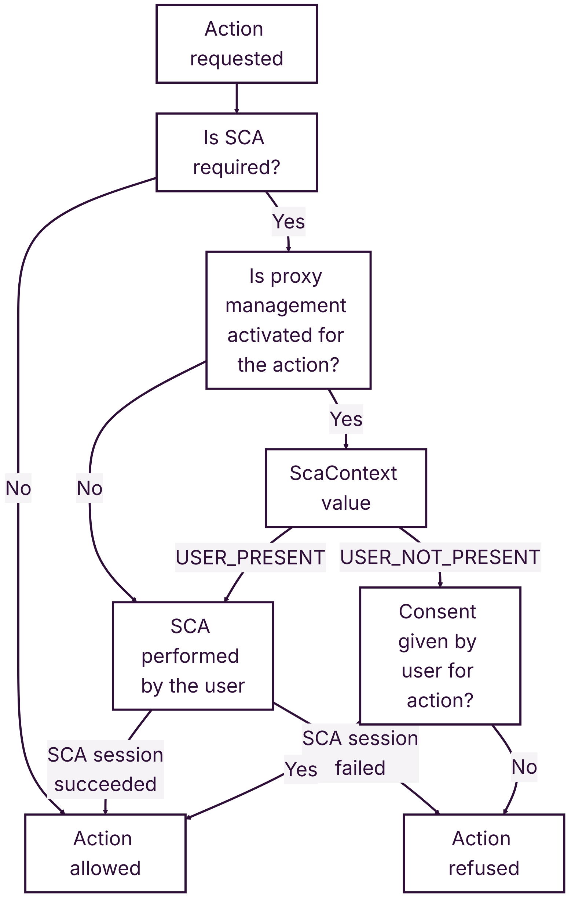
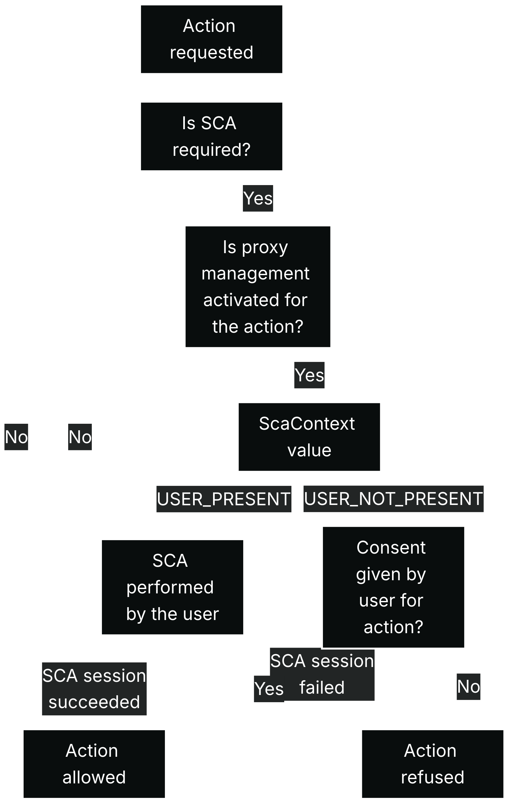

For some platforms, their activity and integration workflow means that they want to take actions on behalf of users in some circumstances.

If the action is one that is subject to SCA, then it is possible for the platform to perform the action on the user’s behalf, but Mangopay must ensure that the user consents.

In order to be allowed to perform an [SCA-triggering action](/guides/sca#actions-requiring-sca) on user’s account: 

- The legal documentation between your platform and the user must include the actions that you take on their behalf by **proxy**
- Mangopay must have the **user’s consent** to the proxy that allows your platform to act on the user’s behalf for the specific action

<Note>
**Note – Acting under proxy requires SCA on your platform** 

The use of proxy and consent to act on a user’s behalf also requires SCA on your platform directly. Mangopay is implementing that by way of a new authentication factor, mTLS certificate, in addition to your existing API key.

[Read more](/guides/sca/platform) **&rarr;**
</Note>

## How Mangopay's proxy management system works

Mangopay’s system for managing proxy involves:

1. **User consent on authorized actions under proxy**
    
  Mangopay will collect and manage consent from end users using the existing SCA session redirection and hosted experience (proxy management system).

  Mangopay has released a new consent endpoint to manage user consent independently of SCA-controlled actions (but consent can also be first collected at the moment of an SCA action).
    
2. **SCA context**
    
  The `ScaContext` parameter is used to orchestrate the logic of whether: 

  - **The user is taking the action:** they are on-session and able to perform SCA and your platform redirects them to the SCA hosted experience (if SCA redirection link is returned by the API, which doesn’t happen if Mangopay applies an exemption). This is the sense of the `USER_PRESENT` value.
  - **The platform is taking the action under proxy** **from the user** and the user has given consent to Mangopay to allow the action. This is the sense of the `USER_NOT_PRESENT` value.

## Integration timeline

<table><thead><tr>
<th class="header">Integration action</th>
<th class="header">Available</th>
<th class="header">Deadline</th>
</tr></thead><tbody><tr>
<td class="table-content">Request activation of the proxy management system</td>
<td class="table-content">Now</td>
<td class="table-content">ASAP</td>
</tr><tr>
<td class="table-content">Start collecting user consent for proxy (via dedicated endpoint and other SCA sessions)</td>
<td class="table-content">Now</td>
<td class="table-content">ASAP</td>
</tr><tr>
<td class="table-content">Integrate consent management endpoint to enable users to revoke consent</td>
<td class="table-content">Now</td>
<td class="table-content">ASAP</td>
</tr><tr>
<td class="table-content">
Ensure you send the relevant `ScaContext` value on all endpoints: 
- Transfers (ensure correct value sent)
- Wallet access (ensure correct value sent)
- Users (new, needed for proxy)
- Recipients (new, needed for proxy)
</td>
<td class="table-content">
Now
</td>
<td class="table-content">
SCA enforced on request before final activation deadline of Dec 15, 2025
</td>
</tr></tbody></table>

## SCA actions under proxy

Provided `UserCategory` is `OWNER` and therefore SCA applies, the actions for which the user can grant proxy to your platform, and consent to Mangopay, are:

<table><thead><tr>
<th class="header">Action</th>
<th class="header">Relevant endpoint(s)</th>
</tr></thead><tbody><tr>
<td class="table-content">
Change SCA contact information (`Email` or `PhoneNumber`)
</td>
<td class="table-content">
- [PUT Update a Natural User (SCA)](/api-reference/users/update-natural-user-sca)
- [PUT Update a Legal User (SCA)](/api-reference/users/update-legal-user-sca)
</td>
</tr><tr>
<td class="table-content">
Retrieve account balances and transactions
</td>
<td class="table-content">
- [GET View a Wallet](/api-reference/wallets/view-wallet)
- [GET List Wallets for a User](/api-reference/wallets/list-wallets-user)
- [GET List Transactions for a User](/api-reference/transactions/list-transactions-user)
- [GET List Transactions for a Wallet](/api-reference/transactions/list-transactions-wallet)
</td>
</tr><tr>
<td class="table-content">
Register or change external accounts
</td>
<td class="table-content">
- [POST Create a Recipient](/api-reference/recipients/create-recipient)
</td>
</tr><tr>
<td class="table-content">
Initiate payment transactions
</td>
<td class="table-content">
- [POST Create a Transfer](/api-reference/transfers/create-transfer)
</td>
</tr></tbody></table>

The consent to each action above requires explicit consent from the user by way of a checkbox via the proxy management system in the hosted experience. 

Note that the action for recipients includes creation and modification, as modification is planned in future even if not possible now.

<Note>
**Note – Proxy consent must reflect your legal documentation**

The actions consented to by the user must reflect the legal documentation that your platform has in place with the user (for example, terms and conditions or a separate document for power of attorney or similar). 

Mangopay is not party to the proxy and only collects user consent.
</Note>

During integration and activation, your platform needs to inform Mangopay which of the 4 SCA-triggering actions for which Mangopay collects consent are included in your proxy.

### Dashboard actions under proxy

Platforms using the Dashboard to complete SCA-triggering actions also need to ensure that a proxy is place for the action, and they need to collect and manage user consent via the API. 

The consent status for a given user will be available in the Dashboard (only, not the API).

## User consent

To manage the consent of the user, Mangopay is leveraging its hosted SCA experience, to which you redirect the user to complete SCA enrollment and authentication.

### New proxy management screen in hosted SCA experience

Mangopay is adding a proxy consent collection screen with a series of checkboxes that allow the user to give consent. 

The screenshot below shows the 4 possible [SCA-triggering actions under proxy](#sca-actions-under-proxy), but only those relevant to the scope of your platform’s proxy agreed with the user will be shown.

A version of the consent screen is displayed in the SCA session: 

1. At the point of **SCA enrollment**, during the first SCA session the user completes (provided SCA by proxy is activated for your platform)
2. On the next SCA session they use following the **activation** of the proxy management system
3. On the next SCA session they use following the **modification** of the proxy actions (that is, if your platform adds an action)
4. Independently of enrollment or an SCA-controlled action, on the SCA session URL returned by the [PUT Manage proxy consent for a User](/api-reference/users/manage-proxy-consent) endpoint

The action of giving consent or changing consent is authenticated by SCA, so once the user ticks the checkbox, they are required to authenticate using their chosen factors. At enrollment, they are asked to enroll their chosen factors.

### User’s control over their consent

The user must be able to revoke their consent via your platform at any time. You need to enable this by integrating the [PUT Manage proxy consent for a User](/api-reference/users/manage-proxy-consent) endpoint. 

The user also has the right to contact Mangopay to revoke their consent. In this case, Mangopay does not plan to proactively inform your platform. You will, however, be able to see a given user’s consent status in the Mangopay Dashboard (but not in the API).

## Integrate the consent endpoint

The [PUT Manage proxy consent for a User](/api-reference/users/manage-proxy-consent) endpoint allows your platform to:

- Collect consent independently of an SCA-triggering action
- Allow the user to revoke their consent, which you need to enable at any time

The endpoint returns a `PendingUserAction.RedirectUrl` on which you need to redirect the user so they can give or revoke their consent. 

<Note>
**Note – Encode and add your returnUrl before redirection**

You must add your `returnUrl` before you redirect the user on the `RedirectUrl` value, otherwise the hosted web page cannot return them upon completion.

For more details, see [**How to redirect a user for SCA**](https://docs.mangopay.com/guides/sca/session#how-to-redirect-a-user-for-sca).
</Note>

### Add an SCA-triggering action to proxy

During integration and activation, your platform needs to inform Mangopay which of the 4 SCA-triggering actions for which Mangopay collects consent are included in your proxy.

It may happen that your platform needs to add a consent scope after activation, to obtain consent for an additional action.

To do so: 

- Contact Mangopay to change the proxy action with appropriate elements to justify that you will need to extend the scope of actions to be performed under proxy (e.g. update terms and conditions and or update power of attorney).
- Obtain consent for the new scope during the next SCA session for that user, which can be via [PUT Manage proxy consent for a User](/api-reference/users/manage-proxy-consent)

Your platform may also wish to remove a proxy action scope. In this case, you need to contact Mangopay and request the change. The user does not need to be notified.

### Difference between enrollment and consent endpoints

The new endpoint to manage consent returns only the SCA redirection link to the hosted experience (`PendingUserAction.RedirectUrl`). 

Its purpose is to obtain or update user consent independently of SCA enrollment (or an SCA-controlled action).

It returns the same body as the existing enrollment endpoint but it serves a different use case:

- [PUT Manage proxy consent for a User](/api-reference/users/manage-proxy-consent) can only be called if the **user is** **already enrolled in SCA** (`UserStatus` is `ACTIVE`)
- [POST Enroll a User in SCA](/api-reference/users/enroll-user) can only be called if the **user is not yet enrolled in SCA** (`UserStatus` is still `ACTIVE`), or is retrying a re-enrollment following a call to a PUT modification endpoint (in this case their `UserStatus` is `PENDING_USER_ACTION`)

## SCA context

To orchestrate the logic of whether an SCA-triggering action is performed by the platform or the user, Mangopay is relying on the `ScaContext` API parameter.

### Definition of ScaContext

With the release of user consent, the values have the following meanings in all cases:

1. `USER_PRESENT` – **The user is taking the SCA-triggering action.** The platform must [redirect the user](/guides/sca/session) using the `PendingUserAction.RedirectUrl` returned so that the user can complete the SCA session (unless Mangopay applied an exemption, so no redirection link was returned).
2. `USER_NOT_PRESENT` – **The platform is taking the action under proxy from the user** and the user has given consent to Mangopay to allow the action. 

The sections below describe how this new behavior is being enforced on cases where it already present, and the cases where it is being newly added.

<Warning>
**Caution – SCA must be performed or consent must be given**

SCA must be performed on all SCA-triggering actions taken by the end user. For all SCA-triggering actions taken by the platform under proxy, Mangopay must have the user’s consent. 

Your platform must send the correct `ScaContext` value in all cases.
</Warning>

### Transfers and wallet access

The `ScaContext` parameter ([defined above](#sca-context)) is already present on the endpoints for the following action scopes:

<table><thead><tr>
<th class="header">Action</th>
<th class="header">Relevant endpoint(s)</th>
</tr></thead><tbody><tr>
<td class="table-content">
Retrieve account balances and transactions
</td>
<td class="table-content">
- [GET View a Wallet](/api-reference/wallets/view-wallet)
- [GET List Wallets for a User](/api-reference/wallets/list-wallets-user)
- [GET List Transactions for a User](/api-reference/transactions/list-transactions-user)
- [GET List Transactions for a Wallet](/api-reference/transactions/list-transactions-wallet)
</td>
</tr><tr>
<td class="table-content">
Initiate payment transactions
</td>
<td class="table-content">
- [POST Create a Transfer](/api-reference/transfers/create-transfer)
</td>
</tr></tbody></table>

However, the proxy management system makes it possible to enforce SCA fully in these scenarios. Therefore, the default value will be changed to enforce SCA:

<table>
<tr>
<th class="header">Previous default value</th>
<td class="table-content">`USER_NOT_PRESENT`</td>
<td class="table-content">Before proxy and user consent management, not sending `ScaContext` or sending `USER_NOT_PRESENT` was a temporary measure used to allow platforms to adopt user-performed SCA.</td>
</tr>
<tr>
<th class="header">New default value</th>
<td class="table-content">`USER_PRESENT`</td>
<td class="table-content">With proxy and consent management, the platform can collect the user’s consent and send `USER_NOT_PRESENT` to indicate that the platform taking the SCA-triggering action. Otherwise, the user must perform SCA.</td>
</tr>
</table>

### User and recipient endpoints

The `ScaContext` parameter ([defined above](#sca-context)) is being added to the endpoints for the following action scopes. 

The default value on users and recipients is `USER_PRESENT`.

<table><thead><tr>
<th class="header">Action</th>
<th class="header">Relevant endpoint(s)</th>
<th class="header">Conditions</th>
</tr></thead><tbody>
<tr>
<td class="table-content">
Change SCA contact information (`Email` or `PhoneNumber`)
</td>
<td class="table-content">
- [PUT Update a Natural User (SCA)](/api-reference/users/update-natural-user-sca)
- [PUT Update a Legal User (SCA)](/api-reference/users/update-legal-user-sca)
</td>
<td class="table-content">
If the request modifies: 
- For a Natural User, the `Email`, `PhoneNumber`, or `PhoneNumberCountry` parameters
- For a Legal User, the `Email`, `PhoneNumber`, or `PhoneNumberCountry` sub-parameters of the `LegalRepresentative` object parameter
</td>
</tr>
<tr>
<td class="table-content">
Register or change external accounts
</td>
<td class="table-content">
- [POST Create a Recipient](/api-reference/recipients/create-recipient)
</td>
<td class="table-content">
If `RecipientScope` is `PAYOUT`
</td>
</tr>
</tbody></table>

Additionally, the `ScaContext` parameter is being added to the following user endpoints:

- [POST Create a Natural User (SCA)](/api-reference/users/create-natural-user-sca)
- [POST Create a Legal User (SCA)](/api-reference/users/create-legal-user-sca)
- [PUT Categorize a Natural User](/api-reference/users/categorize-natural-user)
- [PUT Categorize a Legal User](/api-reference/users/categorize-legal-user)

Account creation is not an action that triggers SCA, but SCA enrollment must ordinarily be completed at the moment of account creation.

However, upon request in certain cases, Mangopay may allow SCA enrollment to be deferred until as soon as possible after account creation. This possibility is considered on a case-by-case basis following a risk analysis. In such cases, it is essential that your platform ensures that your users complete their SCA enrollment using the dedicated [POST Enroll a User](/api-reference/users/enroll-user) endpoint as soon as possible, and implements best practices to ensure that they do (such as periodic reminders). 

The addition of `ScaContext` to the creation and categorization endpoints serves these use cases.

## SCA context decision logic

Mangopay’s SCA solution relies on the `ScaContext` value to determine whether SCA should be performed by the user or by Mangopay.

The logic of the overall flow is shown below:
{/* light mode */}

{/* dark mode */}

Therefore, for an action to be allowed with `ScaContext` set to `USER_NOT_PRESENT`, the following must be true:

- Your platform has a proxy in place to act on the user’s behalf (in your legal documentation)
- The proxy management system is activated for the action
- The user has given their consent to Mangopay for the action

If the user’s consent is missing and thus the action was refused, then your platform has two options: 

1. Obtain consent from the user by calling [PUT Manage proxy consent for a User](/api-reference/users/manage-proxy-consent), and then retry the action
2. Retry the action with user authentication, by setting `ScaContext` to `USER_PRESENT` and redirecting the user on the `PendingUserAction.RedirectUrl` returned

<Note>
**Note – SCA exemptions on specific action**

It may happened that Mangopay can apply an [SCA exemption](/guides/sca#exemptions-available-to-mangopay) on a specific instance of an SCA-triggering **transfer** or **wallet access** request. If this happens, then the `PendingUserAction.RedirectUrl` is not returned even if the `USER_PRESENT` value was sent for `ScaContext`.

This is not reflected in the diagram above.
</Note>