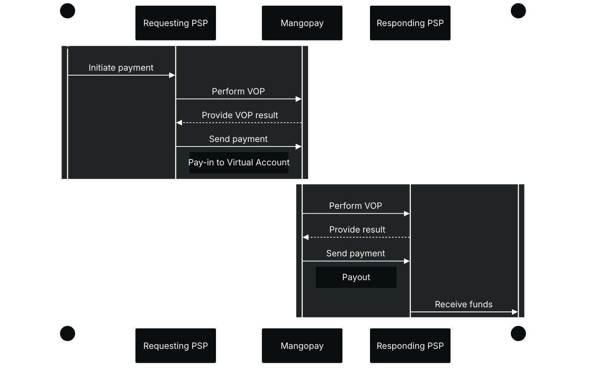

<a href="https://www.europeanpaymentscouncil.eu/what-we-do/other-schemes/verification-payee" target="_blank">Verification of Payee (VOP)</a> is an EU regulatory scheme that aims to protect users from fraud and payment errors during bank wire transfers. The regulation impacts wire payments made in EUR in SEPA's local schemes, meaning SEPA Credit Transfer (SCT) or SEPA Instant Credit Transfer (SCT Inst).

A bank wire transfer involves two payment service providers (PSPs) or banks:
- The **Requesting PSP**, making the payment request on behalf of their customer, the **Payer**. Mangopay is a Requesting PSP in a payout scenario, requesting and receiving the results of the VOP check.
- The **Responding PSP**, who’s customer, the **Payee**, will receive the funds. Mangopay is a Responding PSP in a pay-in scenario, responding with the VOP data.

{/* light mode */}
<div className="block dark:hidden">

</div>
{/* dark mode */}
<div className="hidden dark:block">

</div>

## What Verification of Payee checks

Verification of Payee checks whether the **IBAN** and **account holder name** sent by the Requesting PSP correspond to the combination of that data held by the Responding PSP.

The account holder name can be an individual (John Doe) or a business (Acme Corp.).

There are 4 possible outcomes:

<table><thead>
<tr>
<th class="header">Result</th>
<th class="header">Explanation</th>
<th class="header">Impact</th>
</tr>
</thead><tbody>
<tr>
<td class="table-content">Match</td>
<td class="table-content">The IBAN and account holder name correspond.</td>
<td class="table-content">Payment made to this account will reach its intended counterparty.</td>
</tr><tr>
<td class="table-content">Close Match</td>
<td class="table-content">There are minor discrepancies (such as typos) between the name requested and the one registered.</td>
<td class="table-content">Payment made to this account **may not** reach its intended counterparty.</td>
</tr><tr>
<td class="table-content">No Match</td>
<td class="table-content">The details do not match, indicating a possible error or fraudulent attempt.</td>
<td class="table-content">Payment made to this account **may not** reach its intended counterparty.</td>
</tr><tr>
<td class="table-content">Match Not Possible</td>
<td class="table-content">A technical issue prevents verification from being carried out, such as formatting errors or the responding service being unreachable.</td>
<td class="table-content">Payment made to this account **may not** reach its intended counterparty.</td>
</tr>
</tbody></table>

## Account holder name with Mangopay

Because Verification of Payee checks the account holder name, the identity of the account holder is important. 

Mangopay provides IBANs to platforms to receive pay-ins.

Mangopay allows platforms to offer virtual IBANs in the name of the end user, this is called a **User-Owned Account**.

Otherwise, the virtual IBAN is in the name of Mangopay on behalf of the platform and is used for reconciliation purposes. This is called a **Collection Account**.

Both types of account exist as Banking Alias and Virtual Account objects, as indicated by the `VirtualAccountPurpose` property, with values of `COLLECTION` or `USER_OWNED`.

The table below summarizes the differences, including the impact on the account holder name which is analyzed during the Verification of Payee check.

<table>
  <thead>
    <tr>
      <th class="header"></th>
      <th class="header">Collection account</th>
      <th class="header">User-owned account</th>
    </tr>
  </thead>
  <tbody>
    <tr>
      <th class="header">Purpose</th>
      <td class="table-content">Collection and reconciliation of funds by the platform</td>
      <td class="table-content">User's acceptance and storing of funds</td>
    </tr>
    <tr>
      <th class="header">Account owner</th>
      <td class="table-content">Mangopay S.A. or Mangopay UK Ltd.</td>
      <td class="table-content">Wallet owner</td>
    </tr>
    <tr>
      <th class="header">Account holder name example</th>
      <td class="table-content">"MGP `PlatformTradingName`" *</td>
      <td class="table-content">"`FirstName` `LastName`" (Natural user) or "`Name`" (Legal user)</td>
    </tr>
    <tr>
      <th class="header">Allowed user category</th>
      <td class="table-content">Owner or Payer</td>
      <td class="table-content">Owner</td>
    </tr>
    <tr>
      <th class="header">KYC verification</th>
      <td class="table-content">Not required</td>
      <td class="table-content">Required</td>
    </tr>
    <tr>
      <th class="header">Payouts</th>
      <td class="table-content">Prohibited from the associated  wallet, except for refunds returning funds to their origin</td>
      <td class="table-content">Authorized from the associated wallet</td>
    </tr>
  </tbody>
</table>

\* In all cases except the Marketplace Payment Extension workflow, where the value "Mangopay" is used.

All the API values in the table above refer to properties of the User object except the `PlatformTradingName`, which is held by Mangopay. Your platform can retrieve it via the [GET View a Client](/api-reference/client/view-client) endpoint, where it is the `Name` property, but it is not visible in the Dashboard. Contact Mangopay <a href="https://hub.mangopay.com/" target="_blank">via the Dashboard</a> to change it.

## Impact for your platform

<CardGroup cols={2}>
<Card title="Pay-ins to virtual IBANs" href="/guides/vop/payin" arrow="true" cta="Read more">
<br/>
In a pay-in scenario, as a Responding PSP, Mangopay supplies the account holder name and IBAN to the Requesting PSP.

On the pay-in side, VOP impacts all platforms using the Virtual Account or Banking Alias feature. 
</Card>
<Card title="Recipients and payouts" href="/guides/vop/payout" arrow="true" cta="Read more">
<br/>
In a payout scenario, as a Requesting PSP, Mangopay will be carrying out VOP checks on recipients and payouts.

On the payout side, the VOP impacts platforms whose users hold a User-Owned Account.

In 2026, VOP will be available to all platforms for anti-fraud purposes.
</Card>
</CardGroup>


{/* ## Mangopay’s role in VOP

Mangopay plays the role of both PSP parties in different scenarios: 

- **Requesting PSP** – In a **payout** scenario, Mangopay is sending a payment request and receives the result of the VOP check.
- **Responding PSP** – In a **pay-in** scenario, funds are arriving at an account provided by Mangopay, in which case it is responding with the VOP data.

## Impact on your platform

Verification of Payee has an impact on Mangopay’s banking features in EUR using SCT and SCT Inst, which may impact your platform.

### Pay-in

In a pay-in scenario, as a Responding PSP, Mangopay must correctly supply account holder data, which impacts the legacy [Banking Alias](/api-reference/banking-aliases/banking-alias-object) feature. Mangopay needs to categorize existing and newly created Banking Alias objects to identify those which are held in the name of the user and not Mangopay – these are known as [User-Owned Accounts](#categorization-of-legacy-banking-alias).

**Platforms using User-Owned Accounts** (either **Banking Alias** or [Virtual Account](/api-reference/virtual-accounts/virtual-account-object)), will need to complete an amendment with Mangopay to continue offering these accounts to their users in the user's name. As part of this process, your platform will need to ensure that these users have completed KYC verification.

### Payout

In a payout scenario, as a Requesting PSP, Mangopay will be carrying out VOP checks on:
- Payout requests made in `EUR` using SCT or SCT Inst
- Recipient registrations if `Currency` is `EUR`, `PayoutMethod` is `LocalBankTransfer`, and `Country` is a SEPA country

For **platforms using User-Owned Accounts** (either **Banking Alias** or **Virtual Account**), until the aforementioned amendment is signed, and starting from October 9, 2025, SEPA and SEPA Instant payouts where the VOP outcome is No Match or cannot be performed due to technical error will be blocked – read more about [payouts from user-owned IBANs](#payouts-from-user-owned-accounts). If the VOP result is Match or Partial Match, the payouts will not be blocked. Once the amendment is signed, payouts will not be blocked regardless of the VOP result. 

In future, Mangopay will also provide an endpoint to enable your platform to retrieve the VOP result of Recipients and Bank Accounts that are already registered.

## Categorization of legacy Banking Alias

Mangopay released its new [Virtual Accounts feature](/guides/payment-methods/banking/virtual-iban) to replace the legacy Banking Aliases. One of the benefits of Virtual Accounts is the categorization between **Collection Accounts** and **User-Owned Accounts** (defined in the `VirtualAccountPurpose` field).

These serve very different purposes and have different user-verification requirements which must be met before being created:

<table>
  <thead>
    <tr>
      <th class="header"></th>
      <th class="header">Collection account</th>
      <th class="header">User-owned account</th>
    </tr>
  </thead>
  <tbody>
    <tr>
      <th class="header">Purpose</th>
      <td class="table-content">Collection and reconciliation of funds by the platform</td>
      <td class="table-content">User's acceptance and storing of funds</td>
    </tr>
    <tr>
      <th class="header">Account owner</th>
      <td class="table-content">Mangopay S.A. or Mangopay UK Ltd.</td>
      <td class="table-content">Wallet owner</td>
    </tr>
    <tr>
      <th class="header">Account holder name example</th>
      <td class="table-content">"MGP `PlatformTradingName`"</td>
      <td class="table-content">"`FirstName` `LastName`" (Natural user) or "`Name`" (Legal user)</td>
    </tr>
    <tr>
      <th class="header">Allowed user category</th>
      <td class="table-content">Owner or Payer</td>
      <td class="table-content">Owner</td>
    </tr>
    <tr>
      <th class="header">KYC verification</th>
      <td class="table-content">Not required</td>
      <td class="table-content">Required</td>
    </tr>
    <tr>
      <th class="header">Payouts</th>
      <td class="table-content">Prohibited from the associated  wallet, except for refunds returning funds to their origin</td>
      <td class="table-content">Authorized from the associated wallet</td>
    </tr>
  </tbody>
</table>

The legacy Banking Alias feature does not have these types, and the Verification of Payee regulations require Mangopay to categorize them, so that the correct data can be returned to payers.

### Criteria for categorization

Starting Monday, September 15, 2025, Mangopay will perform a one-time categorize existing and newly created Banking Aliases by adding the `VirtualAccountPurpose` field to the object. Once the categorization is performed, it is final and cannot be changed. This means that the `VirtualAccountPurpose` will not subsequently be changed if the user becomes KYC verified, for example, a new wallet and virtual account would need to be created in future.

The value assigned to the field will depend on the status of the associated User, and the `OwnerName` will be changed (or not) accordingly.

#### User-Owned case

**IF** the User owning the Banking Alias object’s `WalletId` has:

- The `UserCategory` of `OWNER` or `PLATFORM`
- **AND** the `KYCLevel` of `REGULAR`

**THEN**:

- The `USER_OWNED` value will assigned for `VirtualAccountPurpose`
- **AND** the account’s `OwnerName` will not be changed

**Consequences:**

- Payouts requested for the user will continue to be possible
- For pay-ins to these IBANs, the response Mangopay’s service gives as a Responding PSP should be **Match**, because the `OwnerName` is the User’s name as validated by KYC/KYB

#### Collection case

**IF** the User owning the Banking Alias object’s `WalletId` has:

- The `UserCategory` of `PAYER`
- **OR** the `KYCLevel` of `LIGHT`

**THEN**:

- The `COLLECTION` value will assigned for `VirtualAccountPurpose`
- **AND** the account’s `OwnerName` will be changed to “MGP `PlatformTradingName`”

**Consequences**:

- For pay-ins to these IBANs, the response Mangopay’s service gives as Responding PSP will be the IBAN and the platform’s trading name. If, with their PSP or bank, the payer has requested payment to the IBAN in the name of the Mangopay User associated with it, the VOP response will likely be **No Match**. Depending on how this case is handled by their PSP or bank, the payer may or may not be able to proceed with the payment. In a no match scenario, the user will be warned that they will take liability for the payment in the case of fraud.
- Payouts requested for the user will continue to not be possible (as already the case), because the user is not KYC verified.

### Example categorization

<table>
<thead>
<tr>
<th class="header">Account `OwnerName` before categorization</th>
<th class="header">User's `UserCategory`</th>
<th class="header">User's `KYCLevel`</th>
<th class="header">Account `OwnerName` after categorization</th>
<th class="header">Purpose after categorization</th>
</tr>
</thead>
<tbody>
<tr>
<td class="table-content">Alex Smith</td>
<td class="table-content">`PAYER`</td>
<td class="table-content">`LIGHT`</td>
<td class="table-content">MGP PlatformTradingName</td>
<td class="table-content">Collection</td>
</tr>
<tr>
<td class="table-content">Alex Smith</td>
<td class="table-content">`OWNER`</td>
<td class="table-content">`LIGHT`</td>
<td class="table-content">MGP PlatformTradingName</td>
<td class="table-content">Collection</td>
</tr>
<tr>
<td class="table-content">Alex Smith</td>
<td class="table-content">`PAYER`</td>
<td class="table-content">`REGULAR`</td>
<td class="table-content">MGP PlatformTradingName</td>
<td class="table-content">Collection</td>
</tr>
<tr>
<td class="table-content">Alex Smith</td>
<td class="table-content">`OWNER`</td>
<td class="table-content">`REGULAR`</td>
<td class="table-content">Alex Smith</td>
<td class="table-content">User-Owned</td>
</tr>
</tbody>
</table>

### Optional actions to take before categorization

##### Ensure end users have visibility on their virtual account owner name

As the account owner is a data point used in the VOP check, it may be important for users to be able to see this information in the case of a partial match or no match.

You should therefore display this data to your users in your platform's interface.

In the API, this data is the `AccountOwner` of the [Virtual Account](/api-reference/virtual-accounts/virtual-account-object) object or the `OwnerName` of the [Banking Alias](/api-reference/banking-aliases/banking-alias-object) object. 

Alternatively, your platform can retrieve this information via the Dashboard to pass on to the user in case of any issues.

In the Dashboard, both objects are referred to as the “Virtual account”, and the data is “Owner Name”. The virtual account or banking alias object is attached to the Wallet, so you can access it by viewing the details of the wallet which has the account attached: ***User > User ID > Wallets tab > Wallet ID***.

##### Check the categorization criteria for User-Owned accounts

If your platform has Banking Alias objects that users are using in their name, either for pay-ins or payouts, then these users must meet the necessary criteria to be KYC verified.

To retain the use of these IBANs for these users, they need to provide the necessary data to become `OWNER` (including [enrollment in SCA](/guides/sca/users#transition-a-payer-to-owner)) and validate their KYC/B.

If these users do not meet these criteria, and Mangopay assigns the `COLLECTION` value, there may be some consequences as [described above](#collection-case) on pay-ins.

## Payouts from User-Owned Accounts

To enable User-Owned IBANs for their users, platforms need to complete an amendment agreement with Mangopay. Until the amendment is finalized, and starting from October 9, 2025, SCT and SCT Instant payouts from User-Owned IBANs will be blocked when the VOP check returns **No Match** or **Match Not Possible** during the Payout request process.

Payouts where the VOP result is **Match** or **Close Match** will continue to be permitted. Once the amendment is signed, payouts will be permitted whatever the VOP result, and platforms are responsible for displaying the VOP result to the end user.

### Verification of Payee API fields

Mangopay is adding fields to the API response on existing payout and recipient endpoints to return the result of the VOP check performed. As described below, the VOP check will only be performed on User-Owned accounts in the first instance, but Mangopay will extend the feature in 2026 so that all platforms can benefit from the data.

The following endpoints will be enriched with the Verification of Payee in the API response:
- [POST Create a Payout](/api-reference/payouts/create-payout), when the `DebitedWalletId` has a User-Owned Account attached
- [POST Create a Recipient](/api-reference/recipients/create-recipient), when the user has at least one User-Owned Account attached to one of their wallets
- [GET View a Recipient](/api-reference/recipients/view-recipient), when the user has at least one User-Owned Account attached to one of their wallets

The VOP result will be returned in a new object parameter, `RecipientVerificationOfPayee`, which will contain 3 data points:

- `RecipientVerificationId` – A unique identifier of the VOP check performed by Mangopay.
- `RecipientVerificationCheck` – The outcome of the VOP check performed by Mangopay, using the details in the Recipient or Bank Account object referenced in the `BankAccountId` field.
- `RecipientVerificationMessage` – The explanation of the check outcome.

In the future, Mangopay plans to introduce another field, `UserMatchResult`, to indicate if the name returned by the VOP check matches the name of the User who owns the Recipient account.

The fields will give the result of the VOP check:

<table>
<thead>
<tr>
<th class="header">`RecipientVerificationCheck`</th>
<th class="header">`RecipientVerificationMessage`</th>
</tr>
</thead>
<tbody>
<tr>
<td class="table-content">`MATCH`</td>
<td class="table-content">Account name fully matches account identifier.</td>
</tr>
<tr>
<td class="table-content">`CLOSE_MATCH`</td>
<td class="table-content">Account name partially matches account identifier. Name returned by check: FirstName LastName. Payment made to this account may not reach its intended counterparty.</td>
</tr>
<tr>
<td class="table-content">`NO_MATCH`</td>
<td class="table-content">Account name does not match account identifier. Payment made to this account may not reach its intended counterparty.</td>
</tr>
<tr>
<td class="table-content">`MATCH_NOT_POSSIBLE`</td>
<td class="table-content">Responding PSP's verification service unreachable. Payment made to this account may not reach its intended counterparty.</td>
</tr>
</tbody>
</table>

<Check>
**Best practice – Display the result of the VOP check to users**

Your platform can take advantage of the `RecipientVerificationCheck` and `RecipientVerificationMessage` and display them to users. You can do this by retrieving them from the responses to [POST Create a Payout](/api-reference/payouts/create-payout) and the [POST Create a Recipient](/api-reference/recipients/create-recipient) endpoints (once the data has been added).
</Check>

<Note>
**Note – VOP only performed to EUR using SEPA local schemes**

VOP only applies to payments in EUR using SEPA Credit Transfer (SCT) or SEPA Instant Credit Transfer (SCT Inst).

This means the Recipient referenced in the payout's `BankAccountId` has `Currency` of `EUR`, `PayoutMethod` of `LocalBankTransfer`, and `Country` as a SEPA country.

If the `BankAccountId` references a legacy Bank Account, you can retrieve these data points by using the existing `BankAccountId` as the `RecipientId` on the [GET View a Recipient](/api-reference/recipients/view-recipient) endpoint (read more about [recipient migration](/guides/payouts#migration-of-legacy-bank-accounts)).

If the SEPA country also uses a local scheme for the local currency, then Mangopay only applies VOP on the EUR payout and recipient. For example, if you send SEK to a Swedish bank account, the payout uses RIX or RIX-Inst – and the Recipient required has the `Currency` of `SEK`.
</Note>

If the check result is `MATCH`, or `CLOSE_MATCH`, then the Payout endpoint will return a 200 response and the request will proceed as usual with the `RecipientVerificationOfPayee` data in the response body of the payout object.

```json Example 200 response with VOP data (MATCH case)
{
    "Id": "po_b_01K3GM8HWNCVDMACCRA0ZZPH02",
    "Tag": "Created using Mangopay API Postman Collection",
    "CreationDate": 1756126005,
    "AuthorId": "user_m_01K075ZBVXGFYAXM7529W2ZS5W",
    "CreditedUserId": null,
    "DebitedFunds": {
        "Currency": "EUR",
        "Amount": 1000
    },
    "CreditedFunds": {
        "Currency": "EUR",
        "Amount": 900
    },
    "Fees": {
        "Currency": "EUR",
        "Amount": 100
    },
    "Status": "CREATED",
    "ResultCode": null,
    "ResultMessage": null,
    "ExecutionDate": null,
    "Type": "PAYOUT",
    "Nature": "REGULAR",
    "CreditedWalletId": null,
    "DebitedWalletId": "wlt_m_01J9KQE9Z2S4G4R867C5H6W5ZV",
    "PaymentType": "BANK_WIRE",
    "BankAccountId": "rec_01K1ZWF7RJG9MEY8VQ0QE2RQ4D",
    "BankWireRef": "Example123",
    "ModeRequested": null,
    "ModeApplied": "PENDING_RESPONSE",
    "FallbackReason": null,
    "EndToEndId": "3b891fba337d45ec874646ac48565964",
    "PaymentRef": null,
    "RecipientVerificationOfPayee": {
      "RecipientVerificationId": "123456789",
      "RecipientVerificationCheck": "MATCH",
      "RecipientVerificationMessage": "Account name fully matches account identifier."
    }
}
```

If the check result is `NO_MATCH` or `MATCH_NOT_POSSIBLE`, then, beginning on October 9, 2025, and **until the amendment is signed**, the **Payout** endpoint will return a 400 result:

```json Example HTTP 400 result (if not MATCH or CLOSE_MATCH and amendment not signed)
{
    "Id": "44312c27-c681-4240-8df9-a2507bcf30d6",
    "Message": "Payout not allowed because Verification of Payee result is NO_MATCH", // or MATCH_NOT_POSSIBLE
    "Type": "invalid_action",
    "Date": 1747666655.0,
    "errors": null
}
```
This block will **only** apply from October 9, 2025, if the VOP result is `NO_MATCH` or `MATCH_NOT_POSSIBLE` and if the amendment is not signed.

The block will be applied to the user identified as using User-Owned Accounts, meaning any call to the [POST Create a Payout](/api-reference/payouts/create-payout) endpoint where the `BankAccountId` held by the identified user will be rejected (if VOP result is `NO_MATCH` or `MATCH_NOT_POSSIBLE`).

Payouts made by other users not using User-Owned Accounts will not return the VOP data (because the check won't be performed) and they will not be blocked, regardless of whether the platform has signed the amendment or not.

Once the amendment has been signed, a 200 result will be returned and the `RecipientVerificationOfPayee` data will be returned in the body of the Payout object, so that your platform can display it to users.

### VOP on recipients (bank accounts)

#### Recipient registration

Mangopay will also perform VOP checks during recipient registration on the [POST Create a Recipient](/api-reference/recipients/create-recipient) endpoint. This check will only be performed when the user has at least one User-Owned Account attached to one of their wallets.

The response to this endpoint will give the data of the `RecipientVerificationOfPayee` object, with `RecipientVerificationId`, `RecipientVerificationCheck`, and `RecipientVerificationMessage` (see [API fields](#verification-of-payee-api-fields)).

Verification of Payee (VOP) only applies to EUR local schemes (SCT and SCT Inst). This means that for the check to carried out, the Recipient must have `Currency` of `EUR`, `PayoutMethod` of `LocalBankTransfer`, and `Country` as a SEPA country. Note that non-eurozone countries in SEPA (e.g. Poland, Denmark) are only impacted if the currency is `EUR` (e.g. not `PLN` or `DDK` respectively).

#### Existing accounts

For Recipients and Bank Accounts registered for users that have at least one User-Owned Account attached to one of their wallets, Mangopay will also perform a VOP check and return the response on the [GET View a Recipient](/api-reference/recipients/view-recipient) endpoint. Your platform can use this endpoint to retrieve the VOP result for User-Owned IBAN users, for example before requesting a payout. 

The [GET View a Recipient](/api-reference/recipients/view-recipient) endpoint can be used to retrieve the details and VOP check of a legacy Bank Account object, by using its `Id` as the `RecipientId` path parameter, as well as Recipient objects.

The [GET View a Bank Account](/api-reference/bank-accounts/view-bank-account) endpoint will not be enriched with the VOP data. A new VOP check will only be performed when your platform calls [GET View a Recipient](/api-reference/recipients/view-recipient). */}
