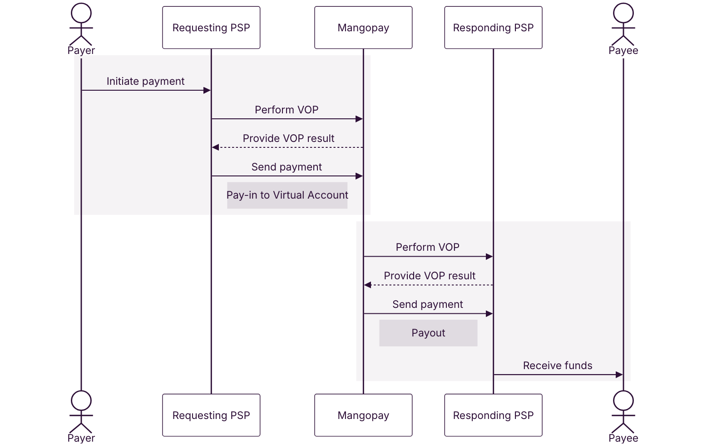
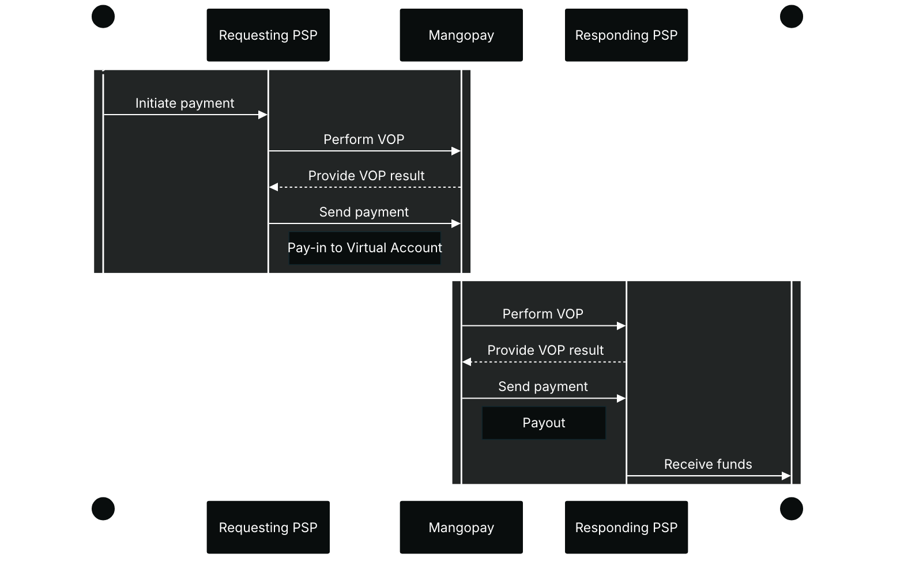

<a href="https://www.europeanpaymentscouncil.eu/what-we-do/other-schemes/verification-payee" target="_blank">Verification of Payee (VOP)</a> is an EU regulatory scheme that aims to protect users from fraud and payment errors during bank wire transfers. The regulation impacts wire payments made in EUR in SEPA's local schemes, meaning SEPA Credit Transfer (SCT) or SEPA Instant Credit Transfer (SCT Inst).

<Note>
**Note – Impact depends on features used**

VOP has particular impact:
- On pay-ins for platforms using Virtual Account or Banking Aliases
- On payouts for platforms offering User-Owned Virtual Accounts

For all platforms, VOP is available on Recipients for anti-fraud purposes.
</Note>

A bank wire transfer involves two payment service providers (PSPs) or banks:
- The **Requesting PSP**, making the payment request on behalf of their customer, the **Payer**. Mangopay is a Requesting PSP in a payout scenario, requesting and receiving the results of the VOP check.
- The **Responding PSP**, who’s customer, the **Payee**, will receive the funds. Mangopay is a Responding PSP in a pay-in scenario, responding with the VOP data.

{/* light mode */}

{/* dark mode */}

## What Verification of Payee checks

Verification of Payee checks whether the **IBAN** and **account holder name** sent by the Requesting PSP correspond to the combination of that data held by the Responding PSP.

The account holder name can be an individual (John Doe) or a business (Acme Corp.).

There are 4 possible outcomes:

<table><thead>
<tr>
<th class="header">Result</th>
<th class="header">Explanation</th>
<th class="header">Impact</th>
</tr>
</thead><tbody>
<tr>
<td class="table-content">Match</td>
<td class="table-content">The IBAN and account holder name correspond.</td>
<td class="table-content">Payment made to this account will reach its intended counterparty.</td>
</tr><tr>
<td class="table-content">Close Match</td>
<td class="table-content">There are minor discrepancies (such as typos) between the name requested and the one registered.</td>
<td class="table-content">Payment made to this account **may not** reach its intended counterparty.</td>
</tr><tr>
<td class="table-content">No Match</td>
<td class="table-content">The details do not match, indicating a possible error or fraudulent attempt.</td>
<td class="table-content">Payment made to this account **may not** reach its intended counterparty.</td>
</tr><tr>
<td class="table-content">Match Not Possible</td>
<td class="table-content">A technical issue prevents verification from being carried out, such as formatting errors or the responding service being unreachable.</td>
<td class="table-content">Payment made to this account **may not** reach its intended counterparty.</td>
</tr>
</tbody></table>

## Account holder name with Mangopay

Because Verification of Payee checks the account holder name, the identity of the account holder is important. 

Mangopay offers platforms the ability to create two types of virtual IBANs: Collection Accounts and User-Owned Accounts.

User-Owned Accounts are created in the name of the platform's end user who owns the wallet, while Collection Accounts are created in the name of Mangopay on behalf of the platform.

Both types of account exist as Banking Alias and Virtual Account objects, as indicated by the `VirtualAccountPurpose` property, with values of `COLLECTION` or `USER_OWNED`.

The table below summarizes the differences, including the impact on the account holder name which is analyzed during the Verification of Payee check.

<table>
  <thead>
    <tr>
      <th class="header"></th>
      <th class="header">Collection account</th>
      <th class="header">User-owned account</th>
    </tr>
  </thead>
  <tbody>
    <tr>
      <th class="header">Purpose</th>
      <td class="table-content">Collection and reconciliation of funds by the platform</td>
      <td class="table-content">User's acceptance and storing of funds</td>
    </tr>
    <tr>
      <th class="header">Account owner</th>
      <td class="table-content">Mangopay S.A. or Mangopay UK Ltd.</td>
      <td class="table-content">Wallet owner</td>
    </tr>
    <tr>
      <th class="header">Account holder name example</th>
      <td class="table-content">"MGP `PlatformTradingName`" *</td>
      <td class="table-content">"`FirstName` `LastName`" (Natural user) or "`Name`" (Legal user)</td>
    </tr>
    <tr>
      <th class="header">Allowed user category</th>
      <td class="table-content">Owner or Payer</td>
      <td class="table-content">Owner</td>
    </tr>
    <tr>
      <th class="header">KYC verification</th>
      <td class="table-content">Not required</td>
      <td class="table-content">Required</td>
    </tr>
    <tr>
      <th class="header">Payouts</th>
      <td class="table-content">Prohibited from the associated wallet, except for refunds returning funds to their origin</td>
      <td class="table-content">Authorized from the associated wallet</td>
    </tr>
  </tbody>
</table>

\* In all cases except the Marketplace Payment Extension workflow, where the value "Mangopay" is used.

Note that in all both cases Mangopay is not the legal owner of funds but only holds them on behalf of its users.

All the API values in the table above refer to properties of the User object except the `PlatformTradingName`, which is held by Mangopay. Your platform can retrieve it via the [GET View a Client](/api-reference/client/view-client) endpoint, where it is the `Name` property, but it is not visible in the Dashboard. Contact Mangopay <a href="https://hub.mangopay.com/" target="_blank">via the Dashboard</a> to change it.

## Impact for your platform

<CardGroup cols={2}>
<Card title="Pay-ins to virtual IBANs" href="/guides/vop/payins" arrow="true" cta="Read more">
 
In a pay-in scenario, as a Responding PSP, Mangopay supplies the account holder name and IBAN to the Requesting PSP.

On the pay-in side, VOP impacts all platforms using the Virtual Account or Banking Alias feature. 
</Card>
<Card title="Recipients and payouts" href="/guides/vop/recipients-payouts" arrow="true" cta="Read more">
 
In a payout scenario, as a Requesting PSP, Mangopay will be carrying out VOP checks on recipients and payouts.

For payouts, VOP impacts platforms whose users hold a User-Owned Account. For Recipients, VOP is available to all platforms for anti-fraud purposes. 
</Card>
</CardGroup>