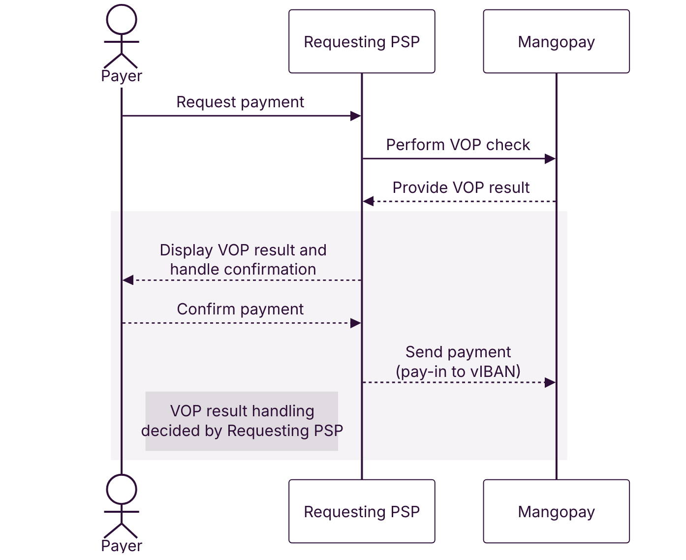
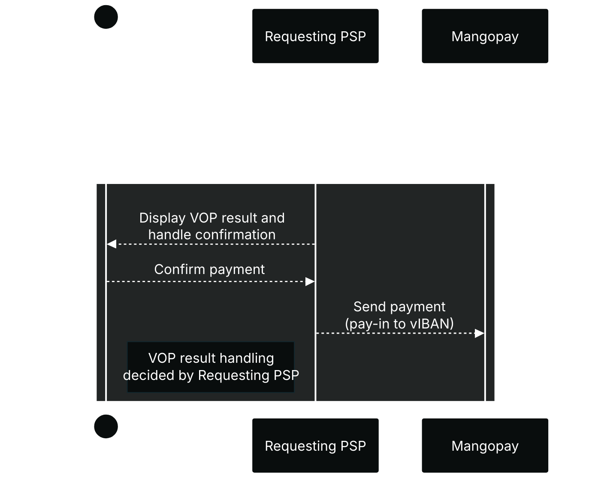

In a pay-in scenario, as a Responding PSP, Mangopay supplies the account holder name and IBAN to the Requesting PSP.

Verification of Payee affects all SCT and SCT Inst EUR payments made to Virtual Accounts and Banking Aliases.

{/* light mode */}

{/* dark mode */}

On the pay-in side, the process is as follows: 

1. The **Payer** initiates the payment to a virtual IBAN, providing the payee’s IBAN and account holder name to their bank. 
2. The Payer’s bank, the **Requesting PSP**, performs the Verification of Payee check with Mangopay. 
3. Mangopay, the **Responding PSP**, checks the name of the payee against the IBAN provided by the Requesting PSP, and responds with a result. The check result is not visible to the your platform in the Mangopay API.
4. The Requesting PSP displays the VOP result to the Payer in their banking app or other interface. The Requesting PSP has discretion over what it displays to the Payer and how it handles the result, wether payment is automatic or upon confirmation by the Payer, for example.

## VOP results

There are 4 possible outcomes of the VOP check:

<table><thead>
<tr>
<th class="header">Result</th>
<th class="header">Explanation</th>
<th class="header">Impact</th>
</tr>
</thead><tbody>
<tr>
<td class="table-content">Match</td>
<td class="table-content">The IBAN and account holder name correspond.</td>
<td class="table-content">Payment made to this account will reach its intended counterparty.</td>
</tr><tr>
<td class="table-content">Close Match</td>
<td class="table-content">There are minor discrepancies (such as typos) between the name requested and the one registered.</td>
<td class="table-content">Payment made to this account **may not** reach its intended counterparty.</td>
</tr><tr>
<td class="table-content">No Match</td>
<td class="table-content">The details do not match, indicating a possible error or fraudulent attempt.</td>
<td class="table-content">Payment made to this account **may not** reach its intended counterparty.</td>
</tr><tr>
<td class="table-content">Match Not Possible</td>
<td class="table-content">A technical issue prevents verification from being carried out, such as formatting errors or the responding service being unreachable.</td>
<td class="table-content">Payment made to this account **may not** reach its intended counterparty.</td>
</tr>
</tbody></table>

## Matching examples

The Requesting PSP has discretion over what it displays to the Payer and what it allows or prevents depending on the result. For example, the PSP might allow the user to continue if the result is **Close Match**, but not **No Match**.

The table below provides examples of the matching scenarios and their outcomes, based on the <a href="https://www.europeanpaymentscouncil.eu/sites/default/files/kb/file/2024-10/EPC288-23%20v1.0%20EPC%20Recommendations%20for%20the%20Matching%20Processes%20under%20the%20VOP%20Scheme%20Rulebook_0.pdf">EPC recommendations for the matching process</a> under the VOP scheme rulebook.

The following is an example only: the Requesting PSP has control over both the mapping and the actions allowed as a result.

<table>
<thead>
<tr>
<th class="header">Name provided by Payer</th>
<th class="header">Virtual IBAN account holder name</th>
<th class="header">VOP result</th>
<th class="header">Comment on result</th>
</tr>
</thead>
<tbody>
<tr>
<td class="table-content">John Doe</td>
<td class="table-content">Jane Smith</td>
<td class="table-content">**No Match**</td>
<td class="table-content">The provided name "John Doe" is entirely different from the account holder name "Jane Smith". There is no overlap, and it does not meet the criteria for a Match or a Close Match.</td>
</tr>
<tr>
<td class="table-content">John Doe</td>
<td class="table-content">Mangopay</td>
<td class="table-content">**No Match**</td>
<td class="table-content">The provided name "John Doe" is entirely different from the account holder name "Mangopay". There is no overlap, and it does not meet the criteria for a Match or a Close Match.</td>
</tr>
<tr>
<td class="table-content">John Doe</td>
<td class="table-content">MGP John Doe</td>
<td class="table-content">**Close Match**</td>
<td class="table-content">**Assumption:** "MGP" is considered an extraneous word or a minor additional identifier by the Responding PSP. While not explicitly listed as a Close Match scenario for natural persons, the document allows for Responding PSPs to apply additional criteria for Close Match, aiming to avoid "No Match" for small deviations. The core "John Doe" matches.</td>
</tr>
<tr>
<td class="table-content">John Doe</td>
<td class="table-content">John Doe</td>
<td class="table-content">**Match**</td>
<td class="table-content">This is an **exact match** of the first name and last name provided by the user with the account holder name, after any standard data cleanup procedures.</td>
</tr>
<tr>
<td class="table-content">Acme</td>
<td class="table-content">MGP Acme</td>
<td class="table-content">**Close Match**</td>
<td class="table-content">**Assumption:** "Acme" is considered an **abbreviated or alternate name** for "MGP Acme". The EPC recommendations for legal persons include "some commonly accepted abbreviations, alternate or abbreviated names are used" as a Close Match scenario. The core name "Acme" is present in both.</td>
</tr>
<tr>
<td class="table-content">Acme</td>
<td class="table-content">Mangopay</td>
<td class="table-content">**No Match**</td>
<td class="table-content">The provided name "Acme" is entirely different from the account holder name "Mangopay". There is no overlap, and it does not meet the criteria for a Match or a Close Match.</td>
</tr>
<tr>
<td class="table-content">Acme GmbH</td>
<td class="table-content">MGP Acme</td>
<td class="table-content">**Close Match**</td>
<td class="table-content">**Assumption:** "GmbH" (a legal form) can be ignored or considered a small deviation, and "MGP" can be considered an abbreviation or part of an alternate commercial name for "Acme". Both names share the core "Acme," fitting the "commonly accepted abbreviations, alternate or abbreviated names" scenario for a Close Match, especially given the PSP's discretion.</td>
</tr>
</tbody>
</table>

### Note on assumptions

- **Data clean-up:** For all scenarios, it is assumed that the Responding PSP performs data clean-up as recommended, such as ignoring upper/lower case, removing non-alphabetic characters (if not part of the name), and truncating spaces, before the matching verification begins.
- **Responding PSP discretion:** The Responding PSP bears full responsibility and has the discretion to determine whether a matching result is a Match, Close Match, or No Match. The aim is to ensure user-friendliness and avoid unnecessary "No Match" responses.
- **"MGP" as an identifier or abbreviation:** For scenarios involving "MGP", it is assumed that this could be a brand prefix, an abbreviation, or an extraneous element that a Responding PSP might consider a small deviation or an alternate name, especially given the discretion and the goal to minimize "No Match" responses.
- **Legal forms:** For legal entities, legal forms like "GmbH" or "SA" are often handled by PSPs in a way that allows the core business name to be matched even if the legal form differs or is omitted.

## Integration recommendations

1. Ensure that the Payer can easily see and copy the relevant value in your platform’s interface: 
- `AccountOwner` returned on [GET View a Virtual Account](/api-reference/virtual-accounts/view-virtual-account#param-account-owner)
- `OwnerName` returned on [GET View a Banking Alias](/api-reference/banking-aliases/view-banking-alias#param-owner-name)
    
This data point is the account holder name against which the VOP check is performed.
    
Your platform should systematically perform a GET call to retrieve and display this data before inviting the user to make the payment.

2. If your platforms is using the Banking Alias endpoints, plan to re-integrate using the the Virtual Accounts endpoints for greater control over the naming pattern, as well as all future feature developments.

The Banking Alias endpoints will be deprecated in Q3 2026.

Banking Alias objects are available via the [GET View a Virtual Account](/api-reference/virtual-accounts/view-virtual-account) endpoint, by using the Banking Alias `Id` and its `WalletId` as the path parameters.

This means your platform can already integrate the GET to retrieve the account data of Banking Alias objects.

3. If your platform is using the Bank Wire PayIn endpoint, ensure Payers are provided the `BankAccount.OwnerName` returned in the response of [POST Create a Bank Wire PayIn](/api-reference/bank-wire-payins/create-bank-wire-payin). Note that for direct bank wire pay-ins, Mangopay is not the responding PSP – that role is played by its partners.

## Banking Alias categorization

The legacy Banking Alias object (replaced by Virtual Accounts) did not allow for accounts to be categorized between **Collection** and **User-Owned**. VOP makes this categorization necessary because Mangopay must provide the correct account holder name data to the Requesting PSP.

The `VirtualAccountPurpose` field has been added to the Banking Alias object to enable categorization.

The categorization applies to all Banking Alias objects, including those with the `Country` value `GB`.

### Criteria for Banking Alias categorization

#### User-Owned case

**IF** the User owning the Banking Alias object’s `WalletId` has:

- The `UserCategory` of `OWNER` or `PLATFORM`
- **AND** the `KYCLevel` of `REGULAR`

**THEN**:

- The `USER_OWNED` value is assigned for `VirtualAccountPurpose`
- **AND** the account’s `OwnerName` will be defined as the `FirstName` and `LastName` for a Natural User or `Name` for a Legal User

<Note>
**Note – Payouts from User-Owned Account holders may be blocked**

[Read more](/guides/vop/recipients-payouts) about how payouts made by User-Owned Account holders are impacted by Verification of Payee.
</Note>

#### Collection case

**IF** the User owning the Banking Alias object’s `WalletId` has:

- The `UserCategory` of `PAYER`
- **OR** the `KYCLevel` of `LIGHT`

**THEN**:

- The `COLLECTION` value is assigned for `VirtualAccountPurpose`
- **AND** the account’s `OwnerName` is changed to “MGP `PlatformTradingName`”

### Example categorization

<table>
<thead>
<tr>
<th class="header">Account `OwnerName` before categorization</th>
<th class="header">User's `UserCategory`</th>
<th class="header">User's `KYCLevel`</th>
<th class="header">Account `OwnerName` after categorization</th>
<th class="header">`VirtualAccountPurpose` after categorization</th>
</tr>
</thead>
<tbody>
<tr>
<td class="table-content">John Doe</td>
<td class="table-content">`PAYER`</td>
<td class="table-content">`LIGHT`</td>
<td class="table-content">MGP `PlatformTradingName`</td>
<td class="table-content">`COLLECTION`</td>
</tr>
<tr>
<td class="table-content">John Doe</td>
<td class="table-content">`OWNER`</td>
<td class="table-content">`LIGHT`</td>
<td class="table-content">MGP `PlatformTradingName`</td>
<td class="table-content">`COLLECTION`</td>
</tr>
<tr>
<td class="table-content">John Doe</td>
<td class="table-content">`PAYER`</td>
<td class="table-content">`REGULAR`</td>
<td class="table-content">MGP `PlatformTradingName`</td>
<td class="table-content">`COLLECTION`</td>
</tr>
<tr>
<td class="table-content">John Doe</td>
<td class="table-content">`OWNER`</td>
<td class="table-content">`REGULAR`</td>
<td class="table-content">John Doe</td>
<td class="table-content">`USER_OWNED`</td>
</tr>
</tbody>
</table>

### One-time categorization for existing accounts

Starting Monday, September 15, 2025, Mangopay will categorize existing and newly created Banking Aliases by setting the `VirtualAccountPurpose` value to either `COLLECTION` or `USER_OWNED`.

In some cases, the `OwnerName` value will be changed to rename the account holder correctly, as described above.

Once the one-time categorization is performed, it is final and cannot be changed. This means that the `VirtualAccountPurpose` will not subsequently be changed if the user becomes KYC verified, for example; a new wallet and virtual account would need to be created in future.

### Ongoing categorization for new accounts

The categorization will also apply to newly created Banking Alias objects.

Platforms using the [POST Create a Banking Alias](/api-reference/banking-aliases/create-iban-banking-alias) endpoint should take this into account:

- The `OwnerName` property is still required but ignored and set automatically by Mangopay. Platforms use the `OwnerName` provided in the response or retrieve it systematically via the [GET View a Banking Alias](/api-reference/banking-aliases/view-banking-alias) endpoint.
- The `VirtualAccountPurpose` is set automatically by Mangopay on creation.