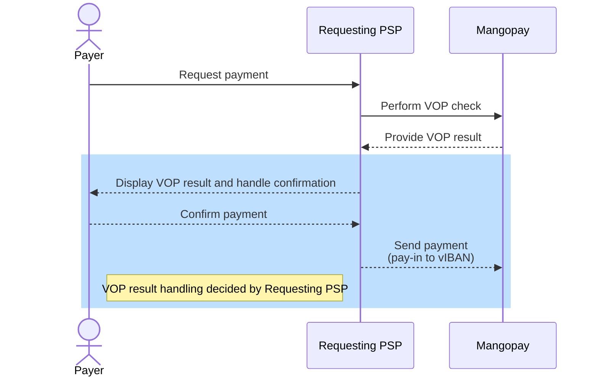

In a pay-in scenario, as a Responding PSP, Mangopay supplies the account holder name and IBAN to the Requesting PSP.

Verification of Payee affects all SCT and SCT Inst EUR payments made to Virtual Accounts and Banking Aliases.

