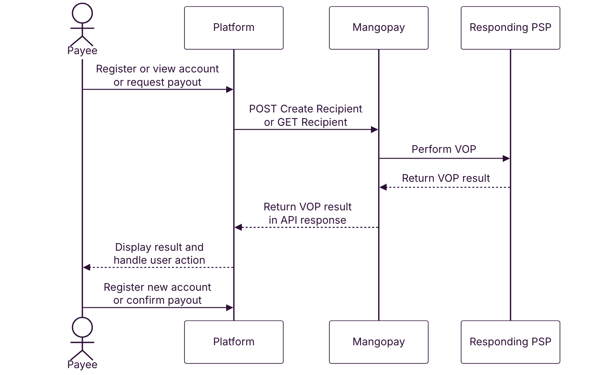
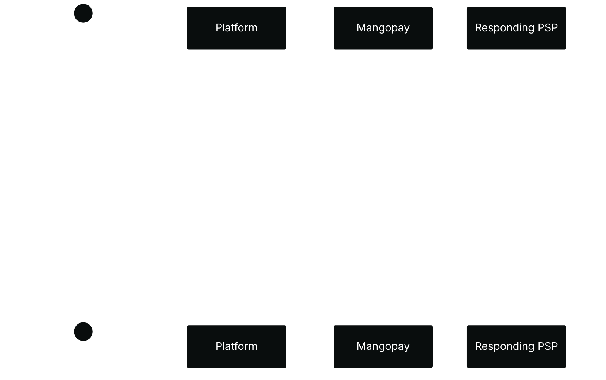
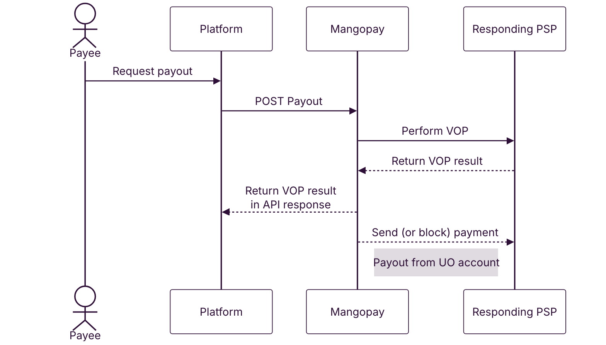
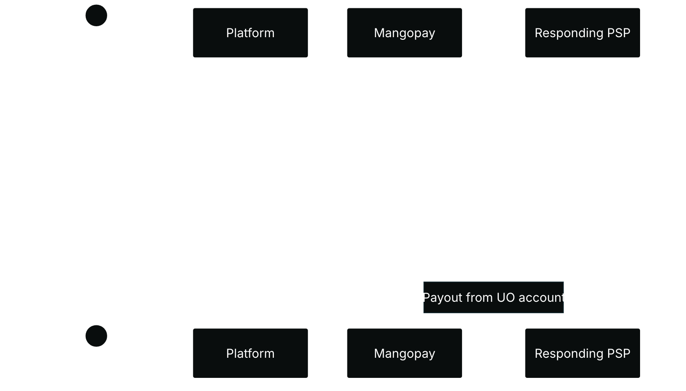
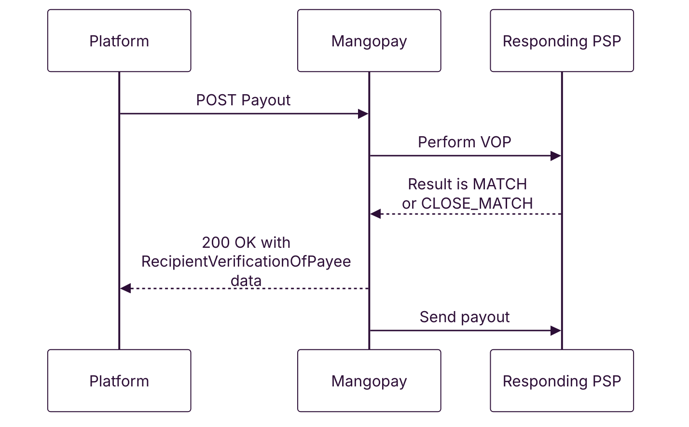
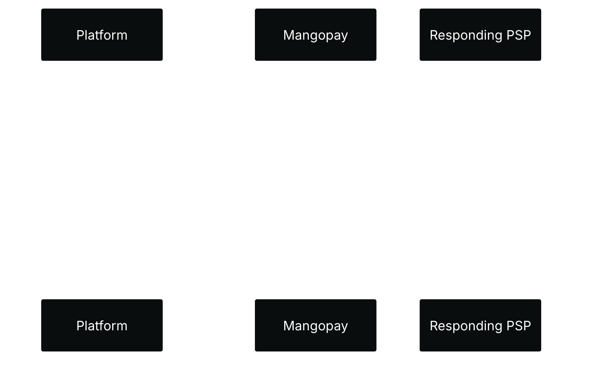
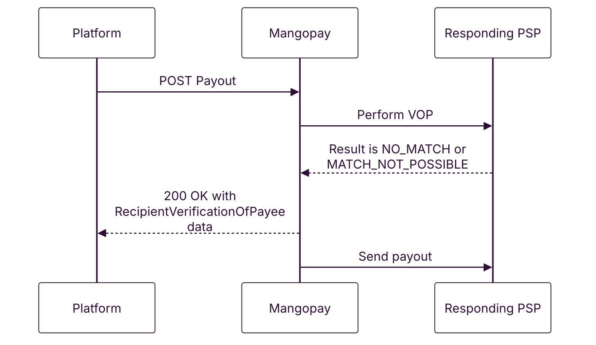
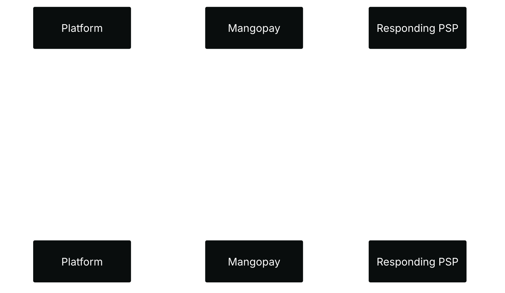
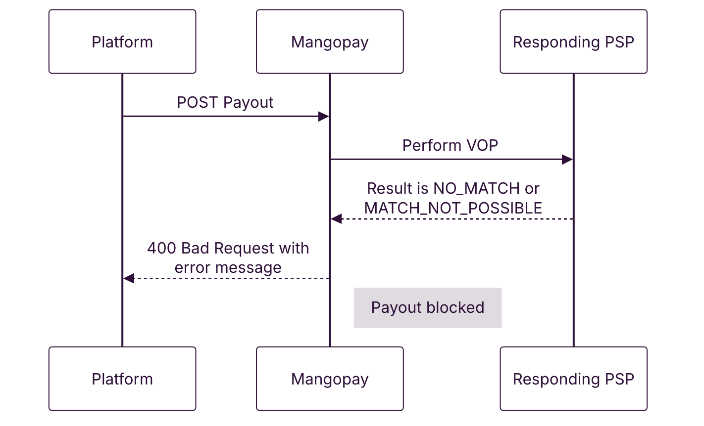
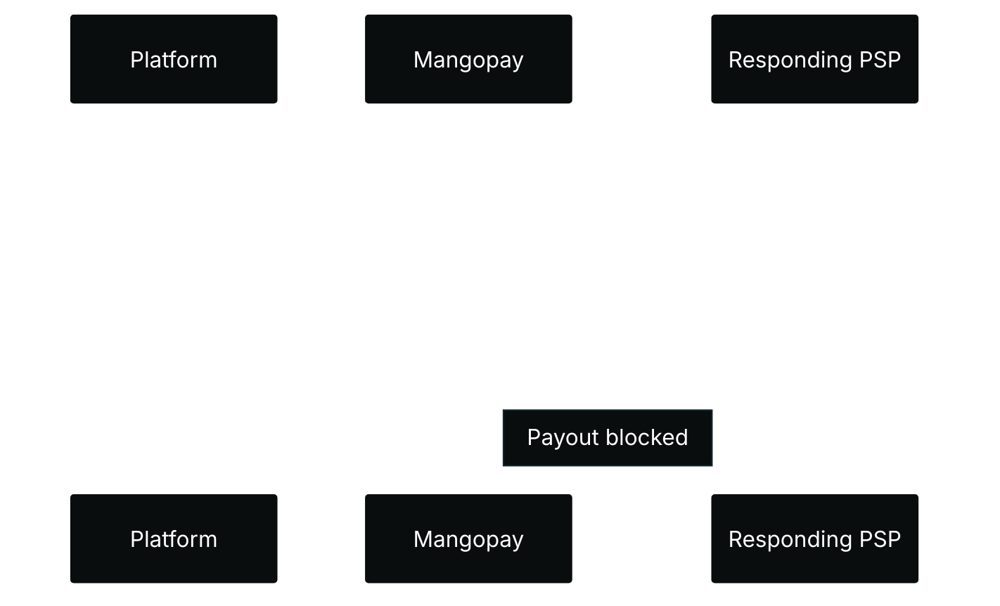

In a payout scenario, as a Requesting PSP, Mangopay will be carrying out VOP checks on recipients and payouts and returning the result in the API response.

## Scope

VOP applies to EUR Recipients and Payouts using SCT or SCT Inst, and for users holding User-Owned Accounts.

In terms of Recipient properties, this means: 

- `Currency` is `EUR`
- `PayoutMethod` is `LocalBankTransfer`
- `Country` is a SEPA country

VOP does not apply to non-EUR payouts in SEPA countries, such as SEK payouts to a bank in Sweden (which uses the local scheme RIX). VOP also does not apply to international payouts, such as EUR to a non-SEPA country or, for example, SEK to a SEPA country that isn’t Sweden, both of which use SWIFT.

<Note>
**Note – Only applies to User-Owned Accounts**

In the first instance, VOP will only be carried out for users who hold a User-Owned Virtual Account. In 2026 Mangopay will make VOP available for all platforms for anti-fraud purposes. 

If your platform does not offer User-Owned Accounts to your users, your payouts are not impacted by Verification of Payee.
</Note>

## VOP result API fields

The following endpoints will be enriched with the Verification of Payee in the API response:

- [POST Create a Payout](/api-reference/payouts/create-payout), if the owner of the payout’s `BankAccountId` has at least one User-Owned Virtual Account
- [POST Create a Recipient](/api-reference/recipients/create-recipient), if the platform offers User-Owned Accounts
- [GET View a Recipient](/api-reference/recipients/view-recipient), if the platform offers User-Owned Accounts

These endpoints will return a new object parameter, `RecipientVerificationOfPayee`, containing: 

- `RecipientVerificationId` – A unique identifier of the VOP check performed by Mangopay.
- `RecipientVerificationCheck` – The outcome of the VOP check performed by Mangopay, using the details in the Recipient or Bank Account object referenced in the `BankAccountId` field.
- `RecipientVerificationMessage` – The explanation of the check outcome.

The fields will give the result of the VOP check:

<table>
<thead>
<tr>
<th class="header">`RecipientVerificationCheck`</th>
<th class="header">`RecipientVerificationMessage`</th>
<th class="header">Scenario</th>
<th class="header">Recommendation</th>
</tr>
</thead>
<tbody>
<tr>
<td class="table-content">`MATCH`</td>
<td class="table-content">Account name fully matches account identifier.</td>
<td class="table-content">The account is valid and the account name matches the IBAN.</td>
<td class="table-content">Proceed with the payout or recipient.</td>
</tr>
<tr>
<td class="table-content">`CLOSE_MATCH`</td>
<td class="table-content">Account name partially matches account identifier. Name returned by check: FirstName LastName. Payment made to this account may not reach its intended counterparty.</td>
<td class="table-content">The account is valid but the name doesn’t match exactly.</td>
<td class="table-content">Confirm details with your user before proceeding. Reregister the Recipient if required.</td>
</tr>
<tr>
<td class="table-content">`NO_MATCH`</td>
<td class="table-content">Account name does not match account identifier. Payment made to this account may not reach its intended counterparty.</td>
<td class="table-content">This account likely belongs to a different owner.</td>
<td class="table-content">Do not proceed until you confirm the account details with the user.</td>
</tr>
<tr>
<td class="table-content">`MATCH_NOT_POSSIBLE`</td>
<td class="table-content">Responding PSP's verification service unreachable. Payment made to this account may not reach its intended counterparty.</td>
<td class="table-content">The check could not be completed.</td>
<td class="table-content">Retry later, or proceed only after confirming the account details with the user.</td>
</tr>
</tbody>
</table>

<Warning>
**Caution – Risk of misdirected payouts**

For any result other than `MATCH`, there is a risk of the funds not reaching their intended destination. Funds sent to the wrong account may not be recoverable.
</Warning>

## Implementation recommendations

1. Retrieve and display the `RecipientVerificationCheck` and `RecipientVerificationMessage` to your users. These data points are both returned in the `RecipientVerificationOfPayee` object on [GET View a Recipient](/api-reference/recipients/view-recipient), [POST Create a Recipient](/api-reference/recipients/create-recipient), and [POST Create a Payout](/api-reference/payouts/create-payout).
2. Check the VOP result of Recipients using [GET View a Recipient](/api-reference/recipients/view-recipient) before initiating payouts, to avoid funds being sent to the wrong account.

## Recipients

If the user has a User-Owned Account, Mangopay performs a VOP check on the endpoints:

- [GET View a Recipient](/api-reference/recipients/view-recipient)
- [POST Create a Recipient](/api-reference/recipients/create-recipient)

VOP is only performed on Recipients where:

- `Currency` is `EUR`
- `PayoutMethod` is `LocalBankTransfer`
- `Country` is a SEPA country

{/* light mode */}
<div className="block dark:hidden">

</div>
{/* dark mode */}
<div className="hidden dark:block">

</div>

The [GET View a Recipient](/api-reference/recipients/view-recipient) and [POST Create a Recipient](/api-reference/recipients/create-recipient) endpoints will return the VOP result in the `RecipientVerificationOfPayee` parameter of the API response:

```json API response - 200 OK expandable
{
    "Id": "rec_01K3V3GWJQBZXQ3HKNWCQCJRXF",
    "Status": "ACTIVE",
    "CreationDate": 1756477551,
    "DisplayName": "ExampleBusinessName EUR FR account",
    "PayoutMethodType": "LocalBankTransfer",
    "RecipientType": "Business",
    "Currency": "EUR",
    "Country": "FR",
    "UserId": "user_m_01JH2Z9GXCCHGFN65T5HDZG4GB",
    "Tag": "Created using the Mangopay API Postman collection",
    "RecipientScope": "PAYOUT",
    "BusinessRecipient": {
        "BusinessName": "ExampleBusinessName",
        "Address": {
            "AddressLine1": "3929 Dickinson Streets",
            "AddressLine2": "Stamm Tunnel",
            "City": "Paris",
            "Region": "Ile de France",
            "PostalCode": "75001",
            "Country": "FR"
        }
    },
    "LocalBankTransfer": {
        "EUR": {
            "IBAN": "FR7630004000031234567890143",
            "BIC": "BNPAFRPPXXX"
        }
    },
		"RecipientVerificationOfPayee": {
			  "RecipientVerificationId": "123456789",
			  "RecipientVerificationCheck": "MATCH",
			  "RecipientVerificationMessage": "Account name fully matches account identifier."
    }
}
```

The [GET View a Recipient](/api-reference/recipients/view-recipient) endpoint returns the latest VOP check performed for that account. If no check has ever been performed (for existing Recipient objects and Bank Account objects), then a new check will be carried out.

The [GET View a Bank Account](/api-reference/bank-accounts/view-bank-account) endpoint will not trigger a VOP check nor return any VOP result. Ensure your platform uses [GET View a Recipient](/api-reference/recipients/view-recipient) object to retrieve account information. 

The Recipient endpoint can be used to retrieve legacy Bank Account objects by using the Bank Account `Id` as the `RecipientId` path parameter.

## Payouts

Mangopay is introducing VOP checks when your platform requests a payout using [POST Create a Payout](/api-reference/payouts/create-payout) only if the owner of the payout’s `BankAccountId` has at least one User-Owned Virtual Account.

If the user doesn't have at least one User-Owned Virtual Account, or if the payout does not use the SCT or SCT Inst rails, then VOP is not performed.

{/* light mode */}
<div className="block dark:hidden">

</div>
{/* dark mode */}
<div className="hidden dark:block">

</div>

The steps are as follows: 

1. Your platform calls [POST Create a Payout](/api-reference/payouts/create-payout).
2. Mangopay performs Verification of Payee (VOP) using the associated Recipient or Bank Account data (reference in the `BankAccountId`) by checking the IBAN and account holder name with the Responding PSP (which is the Payee’s bank).
3. Mangopay returns the VOP result in the API response.
4. Mangopay proceeds with the payment, unless it is blocked as described in the scenarios below.

## Payout scenarios

### Match or close match

When Mangopay performs the VOP check with the Responding PSP, if the result is `MATCH` or `CLOSE_MATCH`, then the payout will continue as before.

{/* light mode */}
<div className="block dark:hidden">

</div>
{/* dark mode */}
<div className="hidden dark:block">

</div>

The [POST Create a Payout](/api-reference/payouts/create-payout) endpoint will return an HTTP 200 result containing the `RecipientVerificationOfPayee` fields:

```json API response - 200 OK expandable
{
    "Id": "po_b_01K3GM8HWNCVDMACCRA0ZZPH02",
    "Tag": "Created using Mangopay API Postman Collection",
    "CreationDate": 1756126005,
    "AuthorId": "user_m_01K075ZBVXGFYAXM7529W2ZS5W",
    "CreditedUserId": null,
    "DebitedFunds": {
        "Currency": "EUR",
        "Amount": 1000
    },
    "CreditedFunds": {
        "Currency": "EUR",
        "Amount": 900
    },
    "Fees": {
        "Currency": "EUR",
        "Amount": 100
    },
    "Status": "CREATED",
    "ResultCode": null,
    "ResultMessage": null,
    "ExecutionDate": null,
    "Type": "PAYOUT",
    "Nature": "REGULAR",
    "CreditedWalletId": null,
    "DebitedWalletId": "wlt_m_01J9KQE9Z2S4G4R867C5H6W5ZV",
    "PaymentType": "BANK_WIRE",
    "BankAccountId": "rec_01K1ZWF7RJG9MEY8VQ0QE2RQ4D",
    "BankWireRef": "Example123",
    "ModeRequested": null,
    "ModeApplied": "PENDING_RESPONSE",
    "FallbackReason": null,
    "EndToEndId": "3b891fba337d45ec874646ac48565964",
    "PaymentRef": null,
    "RecipientVerificationOfPayee": {
      "RecipientVerificationId": "123456789",
      "RecipientVerificationCheck": "MATCH",
      "RecipientVerificationMessage": "Account name fully matches account identifier."
    }
}
```

### No match or match not possible

If the result of the VOP check is `NO_MATCH` or `MATCH_NOT_POSSIBLE`, then the behavior will be as follows.

### Before Oct 9, 2025

{/* light mode */}
<div className="block dark:hidden">

</div>
{/* dark mode */}
<div className="hidden dark:block">

</div>

Before Oct 9, 2025, the payout will continue as normal. The `NO_MATCH` or `MATCH_NOT_POSSIBLE` result will be returned in the `RecipientVerificationOfPayee` object.

This behavior serves as a warning: `NO_MATCH` result means your platform should inform the user that their payment may not reach its intended payee. In these cases, the user should check their account details and re-register the Recipient if necessary.

### After Oct 9, 2025

Mangopay has sent a contract amendment to platforms that offer User-Owned Accounts to their users.

### If amendment signed

{/* light mode */}
<div className="block dark:hidden">

</div>
{/* dark mode */}
<div className="hidden dark:block">

</div>

If the amendment is signed, from Oct 9, 2025, the behavior will stay the same: the payout will continue and the `NO_MATCH` or `MATCH_NOT_POSSIBLE` result will be returned in the `RecipientVerificationOfPayee` object.

### If amendment not signed

{/* light mode */}
<div className="block dark:hidden">

</div>
{/* dark mode */}
<div className="hidden dark:block">

</div>

Until the amendment is signed, from Oct 9, 2025, payouts will be blocked if the VOP result is `NO_MATCH` or `MATCH_NOT_POSSIBLE`.

The [POST Create a Payout](/api-reference/payouts/view-payout) endpoint will return a 400 error:

```json API response - 400 Bad Request
{
    "Id": "44312c27-c681-4240-8df9-a2507bcf30d6",
    "Message": "Payout not allowed because Verification of Payee result is NO_MATCH", // or MATCH_NOT_POSSIBLE
    "Type": "invalid_action",
    "Date": 1747666655.0,
    "errors": null
}
```

Once the amendment is signed, the block will be lifted.

<Note>
**Note – Block only applies to UO account holders**

The block will be applied to users who hold a User-Owned Account. For these users, all payouts will be blocked regardless of which wallet they are debited from (determined by the owner of the payout’s `BankAccountId`).

The block will also only apply to EUR payments via SCT and SCT Inst.

Payouts authored by users without User-Owned Accounts will not be VOP checked and not be blocked because of VOP.
</Note>

## Testing 

In Sandbox, Mangopay provides testing data to allow you to simulate different VOP results when you call [POST Create a Recipient](/api-reference/recipients/create-recipient).

### FR business recipient

<table><thead><tr>
<th class="header">IBAN</th>
<th class="header">`BusinessName`</th>
<th class="header">VOP result</th>
</tr></thead>
<tbody>
<tr>
<td class="table-content" rowSpan={3}>
`FR7630001007941234567890185`
</td>
<td class="table-content">
`EuroCorp`
</td>
<td class="table-content">
`MATCH`
</td>
</tr>
<tr>
<td class="table-content">
`EuroCarp`
</td>
<td class="table-content">
`CLOSE_MATCH`
</td>
</tr>
<tr>
<td class="table-content">
Any other value
</td>
<td class="table-content">
`NO_MATCH`
</td>
</tr>
</tbody>
</table>

Insert the data above in the relevant fields when you call [POST Create a Recipient](/api-reference/recipients/create-recipient), ensuring you follow the schema for a `LocalBankTransfer` payout method with the `Country` set to `FR` and the `Currency` in `EUR`.

Follow the examples below.
#### API request
<CodeGroup>
```json MATCH
{
    "DisplayName": "EuroCorp EUR FR account",
    "PayoutMethodType": "LocalBankTransfer",
    "RecipientType": "Business",
    "Currency": "EUR",
    "Country": "FR",
    "Tag": "Created using the Mangopay API Postman collection",
    "RecipientScope": "PAYOUT",
    "BusinessRecipient": {
        "BusinessName": "EuroCorp", 
        "Address": {
            "AddressLine1": "6 rue de la Cité",
            "AddressLine2": "Appartement 3",
            "City": "Paris",
            "Region": "île-de-France",
            "PostalCode": "75003",
            "Country": "FR"
        }
    },
    "LocalBankTransfer": {
        "EUR": {        
            "IBAN": "FR1420041010050500013M02606"
        }
    }
}
```
```json CLOSE_MATCH
{
    "DisplayName": "EuroCorp EUR FR account",
    "PayoutMethodType": "LocalBankTransfer",
    "RecipientType": "Business",
    "Currency": "EUR",
    "Country": "FR",
    "Tag": "Created using the Mangopay API Postman collection",
    "RecipientScope": "PAYOUT",
    "BusinessRecipient": {
        "BusinessName": "EuroCarp", // Name misspelled with A
        "Address": {
            "AddressLine1": "6 rue de la Cité",
            "AddressLine2": "Appartement 3",
            "City": "Paris",
            "Region": "île-de-France",
            "PostalCode": "75003",
            "Country": "FR"
        }
    },
    "LocalBankTransfer": {
        "EUR": {        
            "IBAN": "FR7630001007941234567890185"
        }
    }
}
```
```json NO_MATCH
{
    "DisplayName": "EuroCorp EUR FR account",
    "PayoutMethodType": "LocalBankTransfer",
    "RecipientType": "Business",
    "Currency": "EUR",
    "Country": "FR",
    "Tag": "Created using the Mangopay API Postman collection",
    "RecipientScope": "PAYOUT",
    "BusinessRecipient": {
        "BusinessName": "InterCorp", // Or any other name
        "Address": {
            "AddressLine1": "6 rue de la Cité",
            "AddressLine2": "Appartement 3",
            "City": "Paris",
            "Region": "île-de-France",
            "PostalCode": "75003",
            "Country": "FR"
        }
    },
    "LocalBankTransfer": {
        "EUR": {        
            "IBAN": "FR7630001007941234567890185"
        }
    }
}
```
</CodeGroup>

#### API response
<CodeGroup>
```json MATCH
{
    "Id": "rec_01K6CYKD6MW45X0TFXS8GSMNWH",
    "Status": "PENDING",
    "CreationDate": 1759223854,
    "DisplayName": "EuroCorp EUR FR account",
    "PayoutMethodType": "LocalBankTransfer",
    "RecipientType": "Business",
    "Currency": "EUR",
    "Country": "FR",
    "UserId": "user_m_01K6ATMK6BA01BHGF14P7M1Q95",
    "RecipientScope": "PAYOUT",
    "Tag": "Created using the Mangopay API Postman collection",
    "BusinessRecipient": {
        "BusinessName": "EuroCorp",
        "Address": {
            "AddressLine1": "6 rue de la Cité",
            "AddressLine2": "Appartement 3",
            "City": "Paris",
            "Region": "île-de-France",
            "PostalCode": "75003",
            "Country": "FR"
        }
    },
    "LocalBankTransfer": {
        "EUR": {
            "IBAN": "FR7630001007941234567890185",
            "BIC": "BDFEFRPPCCT"
        }
    },
    "PendingUserAction": {
        "RedirectUrl": "https://sca.sandbox.mangopay.com/?token=sca_019999e9b6f97eb49e77af2505f5a816"
    },
    "RecipientVerificationOfPayee": {
        "RecipientVerificationId": "383db3d8-2bdd-480d-bed8-28bf5be275a9",
        "RecipientVerificationCheck": "MATCH",
        "RecipientVerificationMessage": "Account name fully matches account identifier."
    }
}
```
```json CLOSE_MATCH
{
    "Id": "rec_01K6CYMN7FTBKKQMP8TYM06CJS",
    "Status": "PENDING",
    "CreationDate": 1759223895,
    "DisplayName": "EuroCorp EUR FR account",
    "PayoutMethodType": "LocalBankTransfer",
    "RecipientType": "Business",
    "Currency": "EUR",
    "Country": "FR",
    "UserId": "user_m_01K6ATMK6BA01BHGF14P7M1Q95",
    "RecipientScope": "PAYOUT",
    "Tag": "Created using the Mangopay API Postman collection",
    "BusinessRecipient": {
        "BusinessName": "EuroCarp",
        "Address": {
            "AddressLine1": "6 rue de la Cité",
            "AddressLine2": "Appartement 3",
            "City": "Paris",
            "Region": "île-de-France",
            "PostalCode": "75003",
            "Country": "FR"
        }
    },
    "LocalBankTransfer": {
        "EUR": {
            "IBAN": "FR7630001007941234567890185",
            "BIC": "BDFEFRPPCCT"
        }
    },
    "PendingUserAction": {
        "RedirectUrl": "https://sca.sandbox.mangopay.com/?token=sca_019999ea569f77f79ecbee7dfaba41d6"
    },
    "RecipientVerificationOfPayee": {
        "RecipientVerificationId": "fb72cf37-c468-48fe-afda-4c747d94cec3",
        "RecipientVerificationCheck": "CLOSE_MATCH",
        "RecipientVerificationMessage": "Account name partially matches account identifier. Name returned by check: EuroCorp. Payment made to this account may not reach its intended counterparty."
    }
}
```
```json NO_MATCH
{
    "Id": "rec_01K6CYNBD687FB7AZ71VCH29SR",
    "Status": "PENDING",
    "CreationDate": 1759223917,
    "DisplayName": "EuroCorp EUR FR account",
    "PayoutMethodType": "LocalBankTransfer",
    "RecipientType": "Business",
    "Currency": "EUR",
    "Country": "FR",
    "UserId": "user_m_01K6ATMK6BA01BHGF14P7M1Q95",
    "RecipientScope": "PAYOUT",
    "Tag": "Created using the Mangopay API Postman collection",
    "BusinessRecipient": {
        "BusinessName": "InterCorp",
        "Address": {
            "AddressLine1": "6 rue de la Cité",
            "AddressLine2": "Appartement 3",
            "City": "Paris",
            "Region": "île-de-France",
            "PostalCode": "75003",
            "Country": "FR"
        }
    },
    "LocalBankTransfer": {
        "EUR": {
            "IBAN": "FR7630001007941234567890185",
            "BIC": "BDFEFRPPCCT"
        }
    },
    "PendingUserAction": {
        "RedirectUrl": "https://sca.sandbox.mangopay.com/?token=sca_019999eaaf667626a742b929d1473822"
    },
    "RecipientVerificationOfPayee": {
        "RecipientVerificationId": "54ad763c-d10b-4e36-b3ae-efd6d54afcf8",
        "RecipientVerificationCheck": "NO_MATCH",
        "RecipientVerificationMessage": "Account name does not matches account identifier. Payment made to this account may not reach its intended counterparty."
    }
}
```
</CodeGroup>

### DE individual recipient

<table><thead><tr>
<th class="header">IBAN</th>
<th class="header">`FirstName`</th>
<th class="header">`LastName`</th>
<th class="header">VOP result</th>
</tr></thead>
<tbody>
<tr>
<td class="table-content" rowSpan={3}>
`DE75512108001245126199`
</td>
<td class="table-content">
`John`
</td>
<td class="table-content">
`Doe`
</td>
<td class="table-content">
`MATCH`
</td>
</tr>
<tr>
<td class="table-content">
`John`
</td>
<td class="table-content">
`Dae`
</td>
<td class="table-content">
`CLOSE_MATCH`
</td>
</tr>
<tr>
<td class="table-content">
Any other value
</td>
<td class="table-content">
Any other value
</td>
<td class="table-content">
`NO_MATCH`
</td>
</tr>
</tbody>
</table>

Insert the data above in the relevant fields when you call [POST Create a Recipient](/api-reference/recipients/create-recipient), ensuring you follow the schema for a `LocalBankTransfer` payout method with the `Country` set to `DE` and the `Currency` in `EUR`.

Follow the examples below.
#### API request
<CodeGroup>
```json MATCH
{
    "DisplayName": "John Doe EUR DE account",
    "PayoutMethodType": "LocalBankTransfer",
    "RecipientType": "Individual",
    "Currency": "EUR",
    "Country": "DE",
    "Tag": "Created using the Mangopay API Postman collection",
    "RecipientScope": "PAYOUT",
    "IndividualRecipient": {
        "FirstName": "John",
        "LastName": "Doe",
        "Address": {
            "AddressLine1": "Oranienburger Str. 87",
            "City": "Berlin",
            "PostalCode": "10178",
            "Country": "DE"
        }
    },
    "LocalBankTransfer": {
        "EUR": {        
            "IBAN": "DE75512108001245126199"
        }
    }
}
```
```json CLOSE_MATCH
{
    "DisplayName": "John Doe EUR DE account",
    "PayoutMethodType": "LocalBankTransfer",
    "RecipientType": "Individual",
    "Currency": "EUR",
    "Country": "DE",
    "Tag": "Created using the Mangopay API Postman collection",
    "RecipientScope": "PAYOUT",
    "IndividualRecipient": {
        "FirstName": "John",
        "LastName": "Dae", // Name misspelled with A
        "Address": {
            "AddressLine1": "Oranienburger Str. 87",
            "City": "Berlin",
            "PostalCode": "10178",
            "Country": "DE"
        }
    },
    "LocalBankTransfer": {
        "EUR": {        
            "IBAN": "DE75512108001245126199"
        }
    }
}
```
```json NO_MATCH
{
    "DisplayName": "John Doe EUR DE account",
    "PayoutMethodType": "LocalBankTransfer",
    "RecipientType": "Individual",
    "Currency": "EUR",
    "Country": "DE",
    "Tag": "Created using the Mangopay API Postman collection",
    "RecipientScope": "PAYOUT",
    "IndividualRecipient": {
        "FirstName": "Jane", // Or any other first name
        "LastName": "Doe", // Or any other last name
        "Address": {
            "AddressLine1": "Oranienburger Str. 87",
            "City": "Berlin",
            "PostalCode": "10178",
            "Country": "DE"
        }
    },
    "LocalBankTransfer": {
        "EUR": {        
            "IBAN": "DE75512108001245126199"
        }
    }
}
```
</CodeGroup>

#### API response
<CodeGroup>
```json MATCH
{
    "Id": "rec_01K6CYKD6MW45X0TFXS8GSMNWH",
    "Status": "PENDING",
    "CreationDate": 1759223854,
    "DisplayName": "EuroCorp EUR FR account",
    "PayoutMethodType": "LocalBankTransfer",
    "RecipientType": "Business",
    "Currency": "EUR",
    "Country": "FR",
    "UserId": "user_m_01K6ATMK6BA01BHGF14P7M1Q95",
    "RecipientScope": "PAYOUT",
    "Tag": "Created using the Mangopay API Postman collection",
    "BusinessRecipient": {
        "BusinessName": "EuroCorp",
        "Address": {
            "AddressLine1": "6 rue de la Cité",
            "AddressLine2": "Appartement 3",
            "City": "Paris",
            "Region": "île-de-France",
            "PostalCode": "75003",
            "Country": "FR"
        }
    },
    "LocalBankTransfer": {
        "EUR": {
            "IBAN": "FR7630001007941234567890185",
            "BIC": "BDFEFRPPCCT"
        }
    },
    "PendingUserAction": {
        "RedirectUrl": "https://sca.sandbox.mangopay.com/?token=sca_019999e9b6f97eb49e77af2505f5a816"
    },
    "RecipientVerificationOfPayee": {
        "RecipientVerificationId": "383db3d8-2bdd-480d-bed8-28bf5be275a9",
        "RecipientVerificationCheck": "MATCH",
        "RecipientVerificationMessage": "Account name fully matches account identifier."
    }
}
```
```json CLOSE_MATCH
{
    "Id": "rec_01K6CZ7Q1357HZ1FY8CY0MKE85",
    "Status": "PENDING",
    "CreationDate": 1759224519,
    "DisplayName": "John Doe EUR DE account",
    "PayoutMethodType": "LocalBankTransfer",
    "RecipientType": "Individual",
    "Currency": "EUR",
    "Country": "DE",
    "UserId": "user_m_01K6ATMK6BA01BHGF14P7M1Q95",
    "RecipientScope": "PAYOUT",
    "Tag": "Created using the Mangopay API Postman collection",
    "IndividualRecipient": {
        "FirstName": "John",
        "LastName": "Dae",
        "Address": {
            "AddressLine1": "Oranienburger Str. 87",
            "City": "Berlin",
            "PostalCode": "10178",
            "Country": "DE"
        }
    },
    "LocalBankTransfer": {
        "EUR": {
            "IBAN": "DE75512108001245126199",
            "BIC": "SOGEDEFFXXX"
        }
    },
    "PendingUserAction": {
        "RedirectUrl": "https://sca.sandbox.mangopay.com/?token=sca_019999f3de167bc19fbbd7b13292e87b"
    },
    "RecipientVerificationOfPayee": {
        "RecipientVerificationId": "50a8f8be-46c4-467b-b820-d5957e9eea92",
        "RecipientVerificationCheck": "CLOSE_MATCH",
        "RecipientVerificationMessage": "Account name partially matches account identifier. Name returned by check: . Payment made to this account may not reach its intended counterparty."
    }
}
```
```json NO_MATCH
{
    "Id": "rec_01K6CZ5KVFHDTK9H9R78F5ZPX7",
    "Status": "PENDING",
    "CreationDate": 1759224450,
    "DisplayName": "John Doe EUR DE account",
    "PayoutMethodType": "LocalBankTransfer",
    "RecipientType": "Individual",
    "Currency": "EUR",
    "Country": "DE",
    "UserId": "user_m_01K6ATMK6BA01BHGF14P7M1Q95",
    "RecipientScope": "PAYOUT",
    "Tag": "Created using the Mangopay API Postman collection",
    "IndividualRecipient": {
        "FirstName": "Jane",
        "LastName": "Doe",
        "Address": {
            "AddressLine1": "Oranienburger Str. 87",
            "City": "Berlin",
            "PostalCode": "10178",
            "Country": "DE"
        }
    },
    "LocalBankTransfer": {
        "EUR": {
            "IBAN": "DE75512108001245126199",
            "BIC": "SOGEDEFFXXX"
        }
    },
    "PendingUserAction": {
        "RedirectUrl": "https://sca.sandbox.mangopay.com/?token=sca_019999f2d0ed7bdbabd6f6d96f2acbf5"
    },
    "RecipientVerificationOfPayee": {
        "RecipientVerificationId": "22e3f171-abbe-42ad-8ab0-1f52b61f7a21",
        "RecipientVerificationCheck": "NO_MATCH",
        "RecipientVerificationMessage": "Account name does not matches account identifier. Payment made to this account may not reach its intended counterparty."
    }
}
```
</CodeGroup>

### Error cases

The following IBANs allow you to simulate error cases with any account holder name.

<table><thead><tr>
<th class="header">IBAN</th>
<th class="header">VOP result</th>
<th class="header">Description</th>
</tr></thead>
<tbody>
<tr>
<td class="table-content">
`FR1420041010050500013M02606`
</td>
<td class="table-content">
`MATCH_NOT_POSSIBLE`
</td>
<td class="table-content">
Simulates a technical error, `RecipientVerificationId` is returned.
</td>
</tr>
<tr>
<td class="table-content">
`FR7630006000011234567890189`
</td>
<td class="table-content">
`MATCH_NOT_POSSIBLE`
</td>
<td class="table-content">
Simulates a PSP not responding, with delayed response and `RecipientVerificationId` as `null`.
</td>
</tr>
</tbody>
</table>